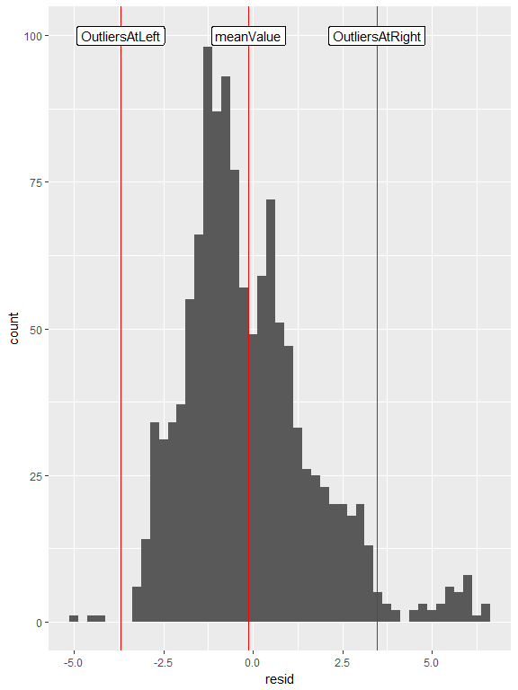

My Report
================
Firstname Gray-Lion
2017-06-123 17:00:00 CDT

Introduction
------------

This report contains my data analysis of a scan of a bullet. This data is stored in the file [bullet.csv](./bullet.csv). The data I analyze is one crosscut of a 3D bullet scan at the micrometer level. The red dotted line in the image below shows an example of a bullet crosscut like the one I analyze. To better understand this data, I looked at a plot of it.


Plot
----

This is my plot. On the *x*-axis, I put the "y" value in my data set. This "y" value is the horizontal position (on the red dotted line) in the image above. On the *y*-axis in my plot, I put the "resid" value in my data set. This "resid" value represents the depth of the striation marks in the bullet. Recall that these values are all measured in micrometers (*μ*m).

``` r
# In the brackets above, delete `eval = FALSE` before clicking `knit`
library(ggplot2)
library(readr)
bullet <- read.csv("bullet.csv")
bullet
```

    ##        x           y    value   fitted        resid         se   abs_resid
    ## 1    250    W*268.75 129.8557 130.8840 -1.028280299 0.21170873 1.028280299
    ## 2    250  K*270.3125 129.6964 131.2163 -1.519923307 0.21058059 1.519923307
    ## 3    250   C*271.875 129.6787 131.5481 -1.869381377 0.20945669 1.869381377
    ## 4    250  S*273.4375 130.1637 131.8793 -1.715559554 0.20833705 1.715559554
    ## 5    250       X*275 130.2345 132.2099 -1.975355881 0.20722167 1.975355881
    ## 6    250  E*276.5625 130.6558 132.5399 -1.884099403 0.20611058 1.884099403
    ## 7    250  Z*285.9375 140.2460 134.5079  5.738178880 0.19953491 5.738178880
    ## 8    250    U*293.75 139.5699 136.1319  3.437945279 0.19417602 3.437945279
    ## 9    250  B*295.3125 141.1913 136.4550  4.736252952 0.19311762 4.736252952
    ## 10   250   V*296.875 142.0267 136.7775  5.249226854 0.19206373 5.249226854
    ## 11   250  F*298.4375 142.4622 137.0994  5.362741938 0.19101435 5.362741938
    ## 12   250       J*300 142.8658 137.4208  5.444975162 0.18996951 5.444975162
    ## 13   250  O*301.5625 143.3401 137.7415  5.598588480 0.18892922 5.598588480
    ## 14   250   Z*303.125 143.6835 138.0617  5.621794849 0.18789350 5.621794849
    ## 15   250  K*304.6875 143.9420 138.3813  5.560615223 0.18686238 5.560615223
    ## 16   250    M*306.25 144.3066 138.7004  5.606218558 0.18583585 5.606218558
    ## 17   250  D*307.8125 144.8836 139.0188  5.864808810 0.18481396 5.864808810
    ## 18   250  X*314.0625 146.3634 140.2869  6.076552101 0.18077297 6.076552101
    ## 19   250   N*315.625 146.4873 140.6024  5.884892273 0.17977446 5.884892273
    ## 20   250  B*317.1875 146.8697 140.9174  5.952240094 0.17878069 5.952240094
    ## 21   250    B*318.75 147.3263 141.2318  6.094509522 0.17779167 6.094509522
    ## 22   250  O*320.3125 147.3901 141.5457  5.844399512 0.17680742 5.844399512
    ## 23   250   Y*321.875 147.5352 141.8589  5.676291019 0.17582796 5.676291019
    ## 24   250  Q*323.4375 147.6874 142.1716  5.515839999 0.17485331 5.515839999
    ## 25   250       R*325 147.6980 142.4837  5.214361407 0.17388348 5.214361407
    ## 26   250  X*326.5625 147.7759 142.7952  4.980722200 0.17291850 4.980722200
    ## 27   250   B*328.125 147.9919 143.1062  4.885726332 0.17195838 4.885726332
    ## 28   250  I*329.6875 147.9352 143.4165  4.518715760 0.17100315 4.518715760
    ## 29   250    F*331.25 148.2114 143.7263  4.485057439 0.17005282 4.485057439
    ## 30   250  Q*332.8125 148.0237 144.0355  3.988216325 0.16910741 3.988216325
    ## 31   250   T*334.375 148.0202 144.3442  3.676040372 0.16816694 3.676040372
    ## 32   250  I*335.9375 147.9636 144.6522  3.311338537 0.16723143 3.311338537
    ## 33   250     A*337.5 147.2449 144.9597  2.285207776 0.16630090 2.285207776
    ## 34   250  M*339.0625 147.5600 145.2666  2.293376044 0.16537537 2.293376044
    ## 35   250   L*340.625 147.3865 145.5729  1.813581296 0.16445486 1.813581296
    ## 36   250  R*342.1875 147.3440 145.8787  1.465348489 0.16353938 1.465348489
    ## 37   250    H*343.75 147.4219 146.1839  1.238058577 0.16262897 1.238058577
    ## 38   250  O*345.3125 147.4750 146.4885  0.986563517 0.16172363 0.986563517
    ## 39   250   A*346.875 147.4219 146.7925  0.629441264 0.16082338 0.629441264
    ## 40   250  Z*348.4375 147.4927 147.0959  0.396799773 0.15992826 0.396799773
    ## 41   250       U*350 147.6025 147.3988  0.203678000 0.15903826 0.203678000
    ## 42   250  U*351.5625 147.6272 147.7011 -0.073831098 0.15815343 0.073831098
    ## 43   250   U*353.125 147.6414 148.0028 -0.361384568 0.15727377 0.361384568
    ## 44   250  R*354.6875 147.7264 148.3039 -0.577557452 0.15639930 0.577557452
    ## 45   250    W*356.25 147.6945 148.6045 -0.909978795 0.15553005 0.909978795
    ## 46   250  A*357.8125 147.3865 148.9045 -1.517955643 0.15466604 1.517955643
    ## 47   250   V*359.375 147.2839 149.2039 -1.920027039 0.15380727 1.920027039
    ## 48   250  Y*360.9375 147.4786 149.5027 -2.024150027 0.15295379 2.024150027
    ## 49   250     C*362.5 148.0167 149.8010 -1.784302652 0.15210559 1.784302652
    ## 50   250  E*364.0625 148.4698 150.0986 -1.628842959 0.15126271 1.628842959
    ## 51   250   U*365.625 148.7211 150.3957 -1.674594991 0.15042517 1.674594991
    ## 52   250  J*367.1875 149.1743 150.6923 -1.517981793 0.14959297 1.517981793
    ## 53   250    M*368.75 149.4823 150.9882 -1.505939411 0.14876615 1.505939411
    ## 54   250  C*370.3125 149.6699 151.2836 -1.613684887 0.14794472 1.613684887
    ## 55   250   C*371.875 149.7620 151.5784 -1.816439266 0.14712870 1.816439266
    ## 56   250  D*373.4375 150.2186 151.8726 -1.653981593 0.14631812 1.653981593
    ## 57   250       G*375 151.0895 152.1663 -1.076751913 0.14551298 1.076751913
    ## 58   250  U*376.5625 151.5143 152.4593 -0.945003269 0.14471332 0.945003269
    ## 59   250   S*378.125 151.4152 152.7518 -1.336620705 0.14391914 1.336620705
    ## 60   250  A*379.6875 151.7126 153.0437 -1.331166268 0.14313048 1.331166268
    ## 61   250    F*381.25 151.9285 153.3351 -1.406560000 0.14234734 1.406560000
    ## 62   250  D*382.8125 152.2436 153.6258 -1.382252946 0.14156975 1.382252946
    ## 63   250   D*384.375 152.2932 153.9160 -1.622881151 0.14079772 1.622881151
    ## 64   250  U*385.9375 152.5693 154.2056 -1.636364658 0.14003128 1.636364658
    ## 65   250     M*387.5 152.9870 154.4947 -1.507666513 0.13927044 1.507666513
    ## 66   250  E*389.0625 153.1180 154.7832 -1.665143760 0.13851522 1.665143760
    ## 67   250   W*390.625 153.2702 155.0710 -1.800805443 0.13776565 1.800805443
    ## 68   250  C*392.1875 153.6349 155.3584 -1.723482607 0.13702173 1.723482607
    ## 69   250    Y*393.75 154.0915 155.6451 -1.553541295 0.13628349 1.553541295
    ## 70   250  A*395.3125 154.1907 155.9312 -1.740578553 0.13555094 1.740578553
    ## 71   250   C*396.875 154.5376 156.2168 -1.679230424 0.13482411 1.679230424
    ## 72   250  D*398.4375 155.0120 156.5018 -1.489860954 0.13410301 1.489860954
    ## 73   250       R*400 154.7713 156.7863 -2.015026186 0.13338765 2.015026186
    ## 74   250  V*401.5625 155.1146 157.0701 -1.955492165 0.13267806 1.955492165
    ## 75   250   V*403.125 155.3235 157.3534 -2.029908936 0.13197425 2.029908936
    ## 76   250  P*404.6875 155.3908 157.6361 -2.245355542 0.13127623 2.245355542
    ## 77   250    V*406.25 155.6244 157.9183 -2.293841028 0.13058403 2.293841028
    ## 78   250  T*407.8125 155.5253 158.1998 -2.674524439 0.12989766 2.674524439
    ## 79   250   R*409.375 155.5430 158.4808 -2.937807819 0.12921714 2.937807819
    ## 80   250  Z*410.9375 156.1200 158.7612 -2.641174212 0.12854248 2.641174212
    ## 81   250     G*412.5 156.4528 159.0411 -2.588234662 0.12787369 2.588234662
    ## 82   250  R*414.0625 157.1644 159.3203 -2.155925215 0.12721080 2.155925215
    ## 83   250   U*415.625 157.5078 159.5990 -2.091215915 0.12655381 2.091215915
    ## 84   250  J*417.1875 157.7344 159.8771 -2.142756805 0.12590275 2.142756805
    ## 85   250    G*418.75 158.0176 160.1546 -2.137080931 0.12525762 2.137080931
    ## 86   250  E*420.3125 158.4778 160.4316 -1.953822336 0.12461843 1.953822336
    ## 87   250   J*421.875 158.5698 160.7080 -2.138164065 0.12398521 2.138164065
    ## 88   250  X*423.4375 158.6867 160.9838 -2.297150163 0.12335796 2.297150163
    ## 89   250       K*425 159.1823 161.2590 -2.076766674 0.12273670 2.076766674
    ## 90   250  Z*426.5625 159.6177 161.5337 -1.915991642 0.12212144 1.915991642
    ## 91   250   G*428.125 159.9682 161.8078 -1.839604112 0.12151218 1.839604112
    ## 92   250  W*429.6875 159.7452 162.0813 -2.336146128 0.12090895 2.336146128
    ## 93   250    J*431.25 160.0496 162.3542 -2.304632734 0.12031174 2.304632734
    ## 94   250  X*432.8125 160.5098 162.6266 -2.116777976 0.11972058 2.116777976
    ## 95   250   D*434.375 160.2195 162.8984 -2.678859896 0.11913547 2.678859896
    ## 96   250  Z*435.9375 160.1027 163.1696 -3.066900541 0.11855641 3.066900541
    ## 97   250     X*437.5 160.6196 163.4403 -2.820680953 0.11798343 2.820680953
    ## 98   250  I*439.0625 160.9453 163.7103 -2.765055178 0.11741652 2.765055178
    ## 99   250   P*440.625 161.0975 163.9798 -2.882322260 0.11685569 2.882322260
    ## 100  250  L*442.1875 161.3701 164.2487 -2.878649243 0.11630096 2.878649243
    ## 101  250    S*443.75 161.8126 164.5171 -2.704476171 0.11575232 2.704476171
    ## 102  250  F*445.3125 162.0994 164.7848 -2.685496090 0.11520978 2.685496090
    ## 103  250   X*446.875 162.1737 165.0520 -2.878350043 0.11467335 2.878350043
    ## 104  250  V*448.4375 162.3896 165.3187 -2.929024076 0.11414303 2.929024076
    ## 105  250       W*450 162.5525 165.5847 -3.032226231 0.11361882 3.032226231
    ## 106  250  S*451.5625 162.5454 165.8502 -3.304782554 0.11310073 3.304782554
    ## 107  250   T*453.125 162.8357 166.1151 -3.279392089 0.11258876 3.279392089
    ## 108  250  K*454.6875 163.0729 166.3794 -3.306529881 0.11208292 3.306529881
    ## 109  250    E*456.25 163.4765 166.6432 -3.166707973 0.11158319 3.166707973
    ## 110  250  O*457.8125 163.5968 166.9064 -3.309523411 0.11108959 3.309523411
    ## 111  250   G*459.375 162.9207 167.1690 -4.248298238 0.11060211 4.248298238
    ## 112  250  P*460.9375 162.4994 167.4310 -4.931608500 0.11012075 4.931608500
    ## 113  250     E*462.5 163.1826 167.6925 -4.509820240 0.10964550 4.509820240
    ## 114  250  L*464.0625 165.1439 167.9533 -2.809466502 0.10917638 2.809466502
    ## 115  250   X*465.625 165.2288 168.2137 -2.984816332 0.10871336 2.984816332
    ## 116  250  A*467.1875 165.6643 168.4734 -2.809117774 0.10825645 2.809117774
    ## 117  250    C*468.75 166.0856 168.7326 -2.647006872 0.10780565 2.647006872
    ## 118  250  U*470.3125 166.2696 168.9912 -2.721512670 0.10736094 2.721512670
    ## 119  250   E*471.875 166.4502 169.2492 -2.798984213 0.10692231 2.798984213
    ## 120  250  F*473.4375 166.7653 169.5066 -2.741358545 0.10648977 2.741358545
    ## 121  250       S*475 167.0591 169.7635 -2.704399711 0.10606331 2.704399711
    ## 122  250  L*476.5625 167.7211 170.0198 -2.298692755 0.10564290 2.298692755
    ## 123  250   X*478.125 168.0256 170.2755 -2.249966721 0.10522855 2.249966721
    ## 124  250  M*479.6875 168.5070 170.5307 -2.023661654 0.10482023 2.023661654
    ## 125  250    L*481.25 168.8008 170.7853 -1.984410598 0.10441795 1.984410598
    ## 126  250  D*482.8125 168.9637 171.0393 -2.075571598 0.10402168 2.075571598
    ## 127  250   Y*484.375 168.5884 171.2927 -2.704262698 0.10363141 2.704262698
    ## 128  250  D*485.9375 168.7902 171.5456 -2.755335943 0.10324713 2.755335943
    ## 129  250     L*487.5 169.1053 171.7978 -2.692553376 0.10286882 2.692553376
    ## 130  250  C*489.0625 169.3637 172.0496 -2.685839043 0.10249646 2.685839043
    ## 131  250   D*490.625 169.5938 172.3007 -2.706873987 0.10213004 2.706873987
    ## 132  250  Z*492.1875 169.7354 172.5513 -2.815839253 0.10176953 2.815839253
    ## 133  250    A*493.75 170.0116 172.8013 -2.789706885 0.10141492 2.789706885
    ## 134  250  R*495.3125 170.4222 173.0507 -2.628475929 0.10106619 2.628475929
    ## 135  250   L*496.875 170.5001 173.2996 -2.799446427 0.10072331 2.799446427
    ## 136  250  A*498.4375 170.7727 173.5478 -2.775136426 0.10038627 2.775136426
    ## 137  250       L*500 171.1196 173.7955 -2.675910968 0.10005503 2.675910968
    ## 138  250  P*501.5625 171.6153 174.0427 -2.427427098 0.09972958 2.427427098
    ## 139  250   P*503.125 171.5728 174.2892 -2.716471862 0.09940989 2.716471862
    ## 140  250  U*504.6875 171.9622 174.5352 -2.573048302 0.09909594 2.573048302
    ## 141  250    B*506.25 172.2348 174.7807 -2.545876464 0.09878768 2.545876464
    ## 142  250  P*507.8125 172.4047 175.0255 -2.620796393 0.09848511 2.620796393
    ## 143  250   M*509.375 172.7658 175.2698 -2.503976131 0.09818818 2.503976131
    ## 144  250  D*510.9375 172.9853 175.5135 -2.528189724 0.09789687 2.528189724
    ## 145  250     J*512.5 173.3251 175.7566 -2.431466217 0.09761116 2.431466217
    ## 146  250  E*514.0625 173.6190 175.9992 -2.380192653 0.09733099 2.380192653
    ## 147  250   Q*515.625 173.8349 176.2412 -2.406231077 0.09705635 2.406231077
    ## 148  250  B*517.1875 173.7854 176.4826 -2.697207534 0.09678720 2.697207534
    ## 149  250    N*518.75 173.9942 176.7234 -2.729181067 0.09652350 2.729181067
    ## 150  250  K*520.3125 174.4261 176.9637 -2.537555770 0.09626519 2.537555770
    ## 151  250   L*521.875 174.9395 177.2034 -2.263936638 0.09601221 2.263936638
    ## 152  250  H*523.4375 175.0881 177.4425 -2.354382572 0.09576452 2.354382572
    ## 153  250       J*525 175.2935 177.6811 -2.387615470 0.09552208 2.387615470
    ## 154  250  Z*526.5625 175.5094 177.9191 -2.409659232 0.09528485 2.409659232
    ## 155  250   Y*528.125 175.7183 178.1565 -2.438211758 0.09505278 2.438211758
    ## 156  250  I*529.6875 176.0581 178.3933 -2.335208947 0.09482585 2.335208947
    ## 157  250    U*531.25 176.4546 178.6296 -2.174993699 0.09460401 2.174993699
    ## 158  250  X*532.8125 176.6564 178.8653 -2.208915914 0.09438723 2.208915914
    ## 159  250   P*534.375 176.9857 179.1005 -2.114822490 0.09417545 2.114822490
    ## 160  250  I*535.9375 177.3149 179.3350 -2.020157328 0.09396864 2.020157328
    ## 161  250     Z*537.5 177.5698 179.5690 -1.999265326 0.09376677 1.999265326
    ## 162  250  M*539.0625 177.7680 179.8025 -2.034444386 0.09356977 2.034444386
    ## 163  250   H*540.625 178.1539 180.0353 -1.881424405 0.09337763 1.881424405
    ## 164  250  Y*542.1875 178.2176 180.2676 -2.049987284 0.09319029 2.049987284
    ## 165  250    L*543.75 178.4300 180.4993 -2.069291923 0.09300770 2.069291923
    ## 166  250  M*545.3125 177.9238 180.7305 -2.806675219 0.09282984 2.806675219
    ## 167  250   T*546.875 178.0512 180.9610 -2.909801075 0.09265665 2.909801075
    ## 168  250  P*548.4375 178.1610 181.1910 -3.030055388 0.09248810 3.030055388
    ## 169  250       D*550 178.5716 181.4205 -2.848826058 0.09232413 2.848826058
    ## 170  250  B*551.5625 179.1735 181.6493 -2.475857985 0.09216470 2.475857985
    ## 171  250   Z*553.125 179.3965 181.8776 -2.481113069 0.09200978 2.481113069
    ## 172  250  V*554.6875 179.6903 182.1053 -2.414993209 0.09185932 2.414993209
    ## 173  250    T*556.25 179.8780 182.3325 -2.454505304 0.09171326 2.454505304
    ## 174  250  X*557.8125 180.1364 182.5590 -2.422643254 0.09157158 2.422643254
    ## 175  250   T*559.375 180.5612 182.7850 -2.223821959 0.09143422 2.223821959
    ## 176  250  B*560.9375 180.8303 183.0104 -2.180194318 0.09130114 2.180194318
    ## 177  250     V*562.5 181.0391 183.2353 -2.196176231 0.09117229 2.196176231
    ## 178  250  F*564.0625 181.3365 183.4596 -2.123082597 0.09104763 2.123082597
    ## 179  250   U*565.625 181.8852 183.6833 -1.798066315 0.09092711 1.798066315
    ## 180  250  Q*567.1875 182.3879 183.9064 -1.518499287 0.09081069 1.518499287
    ## 181  250    D*568.75 182.7348 184.1290 -1.394124409 0.09069832 1.394124409
    ## 182  250  M*570.3125 183.4287 184.3510 -0.922243584 0.09058996 0.922243584
    ## 183  250   P*571.875 184.0270 184.5724 -0.545373709 0.09048556 0.545373709
    ## 184  250  L*573.4375 184.6642 184.7932 -0.128988685 0.09038508 0.128988685
    ## 185  250       I*575 185.6484 185.0135  0.634903589 0.09028847 0.634903589
    ## 186  250  V*576.5625 186.3033 185.2332  1.070135213 0.09019568 1.070135213
    ## 187  250   D*578.125 187.3370 185.4523  1.884736289 0.09010667 1.884736289
    ## 188  250  F*579.6875 187.6202 185.6708  1.949400916 0.09002139 1.949400916
    ## 189  250    V*581.25 188.0875 185.8888  2.198726194 0.08993979 2.198726194
    ## 190  250  M*582.8125 188.4026 186.1062  2.296399225 0.08986184 2.296399225
    ## 191  250   G*584.375 188.9195 186.3230  2.596434108 0.08978748 2.596434108
    ## 192  250  C*585.9375 189.6664 186.5393  3.127151944 0.08971667 3.127151944
    ## 193  250     X*587.5 189.9497 186.7550  3.194684835 0.08964936 3.194684835
    ## 194  250  L*589.0625 190.0665 186.9701  3.096405879 0.08958551 3.096405879
    ## 195  250   B*590.625 190.2612 187.1846  3.076584177 0.08952507 3.076584177
    ## 196  250  J*592.1875 190.4311 187.3986  3.032555831 0.08946799 3.032555831
    ## 197  250    B*593.75 190.6329 187.6119  3.020962940 0.08941424 3.020962940
    ## 198  250  M*595.3125 191.0577 187.8248  3.232973605 0.08936375 3.232973605
    ## 199  250   R*596.875 191.0329 188.0370  2.995960926 0.08931650 2.995960926
    ## 200  250  C*598.4375 191.2631 188.2486  3.014414004 0.08927243 3.014414004
    ## 201  250       V*600 190.9267 188.4597  2.467017939 0.08923149 2.467017939
    ## 202  250  G*601.5625 190.9444 188.6702  2.274211832 0.08919365 2.274211832
    ## 203  250   N*603.125 191.0046 188.8802  2.124461784 0.08915885 2.124461784
    ## 204  250  D*604.6875 191.4471 189.0895  2.357622893 0.08912706 2.357622893
    ## 205  250    L*606.25 191.5144 189.2983  2.216104262 0.08909823 2.216104262
    ## 206  250  N*607.8125 191.5109 189.5065  2.004357990 0.08907230 2.004357990
    ## 207  250   C*609.375 191.8153 189.7141  2.101179179 0.08904925 2.101179179
    ## 208  250  Z*610.9375 192.3534 189.9212  2.432225928 0.08902902 2.432225928
    ## 209  250     B*612.5 192.7499 190.1277  2.622242337 0.08901157 2.622242337
    ## 210  250  G*614.0625 192.9659 190.3336  2.632287508 0.08899685 2.632287508
    ## 211  250   A*615.625 193.3022 190.5389  2.763272541 0.08898483 2.763272541
    ## 212  250  J*617.1875 193.5358 190.7437  2.792170536 0.08897546 2.792170536
    ## 213  250    C*618.75 193.6987 190.9478  2.750840594 0.08896869 2.750840594
    ## 214  250  Q*620.3125 194.0031 191.1514  2.851693815 0.08896448 2.851693815
    ## 215  250   Q*621.875 193.9748 191.3545  2.620349299 0.08896280 2.620349299
    ## 216  250  P*623.4375 193.9925 191.5569  2.435602148 0.08896358 2.435602148
    ## 217  250       R*625 194.1766 191.7588  2.417819461 0.08896681 2.417819461
    ## 218  250  X*626.5625 194.3359 191.9601  2.375831340 0.08897242 2.375831340
    ## 219  250   F*628.125 194.3855 192.1608  2.224675883 0.08898039 2.224675883
    ## 220  250  R*629.6875 194.5660 192.3609  2.205083193 0.08899066 2.205083193
    ## 221  250    Z*631.25 194.7501 192.5605  2.189606369 0.08900320 2.189606369
    ## 222  250  J*632.8125 194.9837 192.7595  2.224269511 0.08901796 2.224269511
    ## 223  250   H*634.375 195.1820 192.9579  2.224107722 0.08903491 2.224107722
    ## 224  250  A*635.9375 195.4404 193.1557  2.284705099 0.08905400 2.284705099
    ## 225  250     Q*637.5 195.5714 193.3530  2.218434745 0.08907519 2.218434745
    ## 226  250  P*639.0625 195.6599 193.5497  2.110260760 0.08909845 2.110260760
    ## 227  250   L*640.625 195.7697 193.7458  2.023905244 0.08912373 2.023905244
    ## 228  250  W*642.1875 195.8475 193.9413  1.906265297 0.08915099 1.906265297
    ## 229  250    I*643.75 195.8794 194.1362  1.743181020 0.08918020 1.743181020
    ## 230  250  D*645.3125 195.9891 194.3306  1.658557514 0.08921131 1.658557514
    ## 231  250   W*646.875 196.0776 194.5244  1.553271879 0.08924429 1.553271879
    ## 232  250  Y*648.4375 196.1237 194.7176  1.406082215 0.08927910 1.406082215
    ## 233  250       O*650 196.2122 194.9102  1.301951623 0.08931569 1.301951623
    ## 234  250  R*651.5625 196.0918 195.1023  0.989532203 0.08935404 0.989532203
    ## 235  250   T*653.125 196.1732 195.2938  0.879478056 0.08939411 0.879478056
    ## 236  250  J*654.6875 196.0387 195.4847  0.554053282 0.08943585 0.554053282
    ## 237  250    M*656.25 196.0599 195.6750  0.384973982 0.08947923 0.384973982
    ## 238  250  Y*657.8125 196.1839 195.8647  0.319137256 0.08952421 0.319137256
    ## 239  250   U*659.375 195.9006 196.0539 -0.153236796 0.08957076 0.153236796
    ## 240  250  S*660.9375 195.9750 196.2425 -0.267478072 0.08961884 0.267478072
    ## 241  250     T*662.5 196.0316 196.4305 -0.398841473 0.08966842 0.398841473
    ## 242  250  T*664.0625 196.0883 196.6179 -0.529625898 0.08971946 0.529625898
    ## 243  250   U*665.625 196.1201 196.8047 -0.684611247 0.08977192 0.684611247
    ## 244  250  M*667.1875 196.2653 196.9910 -0.725733419 0.08982578 0.725733419
    ## 245  250    J*668.75 196.4317 197.1767 -0.745036313 0.08988099 0.745036313
    ## 246  250  N*670.3125 196.5804 197.3618 -0.781459830 0.08993752 0.781459830
    ## 247  250   S*671.875 196.7963 197.5463 -0.750040868 0.08999534 0.750040868
    ## 248  250  N*673.4375 196.9733 197.7303 -0.756984328 0.09005441 0.756984328
    ## 249  250       D*675 197.0724 197.9137 -0.841231109 0.09011471 0.841231109
    ## 250  250  T*676.5625 197.2636 198.0965 -0.832854110 0.09017620 0.832854110
    ## 251  250   D*678.125 197.5397 198.2787 -0.738934231 0.09023884 0.738934231
    ## 252  250  I*679.6875 197.7592 198.4603 -0.701076371 0.09030261 0.701076371
    ## 253  250    S*681.25 198.0318 198.6413 -0.609536431 0.09036747 0.609536431
    ## 254  250  C*682.8125 198.1699 198.8218 -0.651941309 0.09043339 0.651941309
    ## 255  250   T*684.375 198.2938 199.0017 -0.707926905 0.09050033 0.707926905
    ## 256  250  C*685.9375 198.4425 199.1810 -0.738551119 0.09056828 0.738551119
    ## 257  250     S*687.5 198.9204 199.3597 -0.439361850 0.09063720 0.439361850
    ## 258  250  R*689.0625 199.1186 199.5379 -0.419262998 0.09070705 0.419262998
    ## 259  250   G*690.625 199.3558 199.7155 -0.359641462 0.09077782 0.359641462
    ## 260  250  M*692.1875 199.2921 199.8925 -0.600352143 0.09084946 0.600352143
    ## 261  250    Q*693.75 199.5257 200.0689 -0.543108938 0.09092195 0.543108938
    ## 262  250  A*695.3125 199.8904 200.2447 -0.354299748 0.09099526 0.354299748
    ## 263  250   L*696.875 199.9966 200.4199 -0.423340473 0.09106936 0.423340473
    ## 264  250  Y*698.4375 200.2692 200.5946 -0.325413012 0.09114422 0.325413012
    ## 265  250       X*700 199.9293 200.7687 -0.839349265 0.09121982 0.839349265
    ## 266  250  C*701.5625 200.3577 200.9422 -0.584492130 0.09129613 0.584492130
    ## 267  250   B*703.125 200.5382 201.1151 -0.576864508 0.09137312 0.576864508
    ## 268  250  B*704.6875 200.7790 201.2874 -0.508472299 0.09145076 0.508472299
    ## 269  250    P*706.25 200.9595 201.4592 -0.499681401 0.09152902 0.499681401
    ## 270  250  F*707.8125 201.1719 201.6304 -0.458446714 0.09160788 0.458446714
    ## 271  250   Z*709.375 201.4551 201.8010 -0.345828139 0.09168732 0.345828139
    ## 272  250  L*710.9375 201.5861 201.9710 -0.384852573 0.09176731 0.384852573
    ## 273  250     U*712.5 201.7348 202.1404 -0.405594918 0.09184781 0.405594918
    ## 274  250  G*714.0625 202.1278 202.3092 -0.181485072 0.09192881 0.181485072
    ## 275  250   F*715.625 202.3756 202.4775 -0.101938935 0.09201028 0.101938935
    ## 276  250  X*717.1875 202.6092 202.6452 -0.035971407 0.09209220 0.035971407
    ## 277  250    C*718.75 202.7862 202.8123 -0.026063386 0.09217454 0.026063386
    ## 278  250  T*720.3125 202.8216 202.9788 -0.157177774 0.09225728 0.157177774
    ## 279  250   I*721.875 202.7614 203.1447 -0.383294468 0.09234040 0.383294468
    ## 280  250  Z*723.4375 202.9774 203.3101 -0.332696370 0.09242386 0.332696370
    ## 281  250       E*725 203.1013 203.4749 -0.373559377 0.09250765 0.373559377
    ## 282  250  S*726.5625 203.1367 203.6390 -0.502343390 0.09259174 0.502343390
    ## 283  250   T*728.125 203.3102 203.8026 -0.492477309 0.09267612 0.492477309
    ## 284  250  U*729.6875 203.4164 203.9657 -0.549292033 0.09276075 0.549292033
    ## 285  250    G*731.25 203.4518 204.1281 -0.676326461 0.09284562 0.676326461
    ## 286  250  A*732.8125 203.6323 204.2899 -0.657630493 0.09293071 0.657630493
    ## 287  250   U*734.375 203.8518 204.4512 -0.599411028 0.09301598 0.599411028
    ## 288  250  F*735.9375 204.4253 204.6119 -0.186591967 0.09310143 0.186591967
    ## 289  250     N*737.5 204.8891 204.7720  0.117065792 0.09318704 0.117065792
    ## 290  250  Y*739.0625 205.0944 204.9315  0.162876348 0.09327277 0.162876348
    ## 291  250   I*740.625 205.4661 205.0905  0.375657803 0.09335861 0.375657803
    ## 292  250  A*742.1875 205.7883 205.2488  0.539461257 0.09344454 0.539461257
    ## 293  250    N*743.75 205.9511 205.4066  0.544542810 0.09353054 0.544542810
    ## 294  250  U*745.3125 206.0998 205.5637  0.536047562 0.09361659 0.536047562
    ## 295  250   P*746.875 206.4149 205.7203  0.694522615 0.09370267 0.694522615
    ## 296  250  G*748.4375 206.5742 205.8764  0.697817068 0.09378876 0.697817068
    ## 297  250       O*750 206.9388 206.0318  0.907024022 0.09387485 0.907024022
    ## 298  250  C*751.5625 207.1406 206.1866  0.953968578 0.09396090 0.953968578
    ## 299  250   C*753.125 207.2893 206.3409  0.948395835 0.09404692 0.948395835
    ## 300  250  B*754.6875 207.8026 206.4946  1.308042895 0.09413287 1.308042895
    ## 301  250    F*756.25 208.1814 206.6477  1.533748858 0.09421874 1.533748858
    ## 302  250  T*757.8125 208.4257 206.8002  1.625480534 0.09430343 1.625480534
    ## 303  250   U*759.375 208.7691 206.9522  1.816853301 0.09438588 1.816853301
    ## 304  250  N*760.9375 208.9850 207.1037  1.881299108 0.09446610 1.881299108
    ## 305  250     A*762.5 209.1585 207.2547  1.903781906 0.09454412 1.903781906
    ## 306  250  O*764.0625 209.3107 207.4052  1.905543646 0.09461996 1.905543646
    ## 307  250   O*765.625 209.7178 207.5551  2.162717276 0.09469367 2.162717276
    ## 308  250  P*767.1875 210.1462 207.7045  2.441652747 0.09476527 2.441652747
    ## 309  250    P*768.75 210.3869 207.8534  2.533484010 0.09483481 2.533484010
    ## 310  250  A*770.3125 210.5710 208.0018  2.569196015 0.09490231 2.569196015
    ## 311  250   T*771.875 210.8330 208.1497  2.683316711 0.09496783 2.683316711
    ## 312  250  T*773.4375 210.9710 208.2970  2.674057049 0.09503141 2.674057049
    ## 313  250       W*775 211.1728 208.4438  2.729047980 0.09509309 2.729047980
    ## 314  250  A*776.5625 211.4383 208.5900  2.848287452 0.09515292 2.848287452
    ## 315  250   Z*778.125 211.6543 208.7358  2.918494417 0.09521095 2.918494417
    ## 316  250  N*779.6875 211.8242 208.8810  2.943208824 0.09526724 2.943208824
    ## 317  250    G*781.25 212.0720 209.0257  3.046336625 0.09532183 3.046336625
    ## 318  250  X*782.8125 212.3163 209.1698  3.146455768 0.09537479 3.146455768
    ## 319  250   F*784.375 212.3623 209.3135  3.048859204 0.09542616 3.048859204
    ## 320  250  I*785.9375 212.6561 209.4565  3.199605883 0.09547601 3.199605883
    ## 321  250     S*787.5 212.5429 209.5991  2.943769756 0.09552439 2.943769756
    ## 322  250  A*789.0625 212.3659 209.7411  2.624746772 0.09557137 2.624746772
    ## 323  250   G*790.625 212.6951 209.8826  2.812499881 0.09561700 2.812499881
    ## 324  250  S*792.1875 212.6597 210.0235  2.636156035 0.09566135 2.636156035
    ## 325  250    L*793.75 212.8402 210.1639  2.676298183 0.09570448 2.676298183
    ## 326  250  R*795.3125 212.5393 210.3038  2.235520275 0.09574645 2.235520275
    ## 327  250   W*796.875 212.2313 210.4431  1.788202261 0.09578733 1.788202261
    ## 328  250  E*798.4375 212.2242 210.5819  1.642336091 0.09582717 1.642336091
    ## 329  250       K*800 212.6668 210.7202  1.946610716 0.09586605 1.946610716
    ## 330  250  Z*801.5625 212.7163 210.8579  1.858472086 0.09590403 1.858472086
    ## 331  250   J*803.125 212.7057 210.9950  1.710695151 0.09594117 1.710695151
    ## 332  250  Z*804.6875 212.8296 211.1316  1.697987861 0.09597754 1.697987861
    ## 333  250    Q*806.25 213.2473 211.2677  1.979658167 0.09601321 1.979658167
    ## 334  250  A*807.8125 213.2792 211.4032  1.875999017 0.09604823 1.875999017
    ## 335  250   K*809.375 213.2438 211.5382  1.705625364 0.09608267 1.705625364
    ## 336  250  F*810.9375 213.2721 211.6726  1.599522156 0.09611660 1.599522156
    ## 337  250     R*812.5 213.5022 211.8065  1.695756344 0.09615009 1.695756344
    ## 338  250  Y*814.0625 213.4739 211.9398  1.534110878 0.09618319 1.534110878
    ## 339  250   J*815.625 213.5341 212.0726  1.461519708 0.09621596 1.461519708
    ## 340  250  Q*817.1875 213.3819 212.2048  1.177072785 0.09624848 1.177072785
    ## 341  250    V*818.75 213.4102 212.3365  1.073726058 0.09628080 1.073726058
    ## 342  250  L*820.3125 213.5907 212.4676  1.123160478 0.09631299 1.123160478
    ## 343  250   Z*821.875 213.3146 212.5981  0.716469995 0.09634511 0.716469995
    ## 344  250  S*823.4375 213.1872 212.7281  0.459022559 0.09637720 0.459022559
    ## 345  250       G*825 213.4137 212.8576  0.556147120 0.09640935 0.556147120
    ## 346  250  C*826.5625 213.6545 212.9865  0.667988628 0.09644159 0.667988628
    ## 347  250   B*828.125 213.3854 213.1148  0.270609034 0.09647399 0.270609034
    ## 348  250  J*829.6875 213.4421 213.2426  0.199483288 0.09650661 0.199483288
    ## 349  250    H*831.25 213.5695 213.3698  0.199720339 0.09653949 0.199720339
    ## 350  250  F*832.8125 213.6509 213.4964  0.154497139 0.09657270 0.154497139
    ## 351  250   P*834.375 213.7642 213.6225  0.141698636 0.09660628 0.141698636
    ## 352  250  G*835.9375 214.1642 213.7480  0.416214782 0.09664028 0.416214782
    ## 353  250     I*837.5 214.3129 213.8730  0.439945527 0.09667476 0.439945527
    ## 354  250  C*839.0625 214.4793 213.9974  0.481942820 0.09670976 0.481942820
    ## 355  250   M*840.625 214.7059 214.1212  0.584688611 0.09674532 0.584688611
    ## 356  250  Y*842.1875 214.4014 214.2445  0.156980852 0.09678150 0.156980852
    ## 357  250    X*843.75 214.3802 214.3671  0.013052492 0.09681832 0.013052492
    ## 358  250  B*845.3125 214.2386 214.4893 -0.250671519 0.09685585 0.250671519
    ## 359  250   H*846.875 214.3129 214.6108 -0.297876230 0.09689411 0.297876230
    ## 360  250  B*848.4375 214.5324 214.7318 -0.199363692 0.09693314 0.199363692
    ## 361  250       E*850 214.7908 214.8522 -0.061337954 0.09697297 0.061337954
    ## 362  250  K*851.5625 215.0068 214.9720  0.034779933 0.09701365 0.034779933
    ## 363  250   E*853.125 214.9679 215.0913 -0.123418079 0.09705520 0.123418079
    ## 364  250  O*854.6875 214.8546 215.2100 -0.355385041 0.09709766 0.355385041
    ## 365  250    M*856.25 214.7908 215.3281 -0.537214002 0.09714104 0.537214002
    ## 366  250  I*857.8125 214.9502 215.4456 -0.495436013 0.09718538 0.495436013
    ## 367  250   R*859.375 215.0705 215.5625 -0.492022123 0.09723071 0.492022123
    ## 368  250  I*860.9375 215.3042 215.6789 -0.374745383 0.09727703 0.374745383
    ## 369  250     V*862.5 215.5484 215.7947 -0.246267841 0.09732438 0.246267841
    ## 370  250  M*864.0625 215.7007 215.9099 -0.209253548 0.09737277 0.209253548
    ## 371  250   O*865.625 215.7431 216.0245 -0.281401554 0.09742222 0.281401554
    ## 372  250  A*867.1875 215.8210 216.1386 -0.317565908 0.09747273 0.317565908
    ## 373  250    D*868.75 215.8494 216.2521 -0.402708661 0.09752432 0.402708661
    ## 374  250  U*870.3125 215.9874 216.3649 -0.377521862 0.09757701 0.377521862
    ## 375  250   I*871.875 216.3131 216.4772 -0.164122561 0.09763079 0.164122561
    ## 376  250  P*873.4375 216.6848 216.5889  0.095885193 0.09768566 0.095885193
    ## 377  250       E*875 216.7733 216.7001  0.073269348 0.09774164 0.073269348
    ## 378  250  X*876.5625 216.8264 216.8106  0.015839856 0.09779873 0.015839856
    ## 379  250   I*878.125 216.8725 216.9205 -0.048080333 0.09785691 0.048080333
    ## 380  250  V*879.6875 217.1273 217.0299  0.097457730 0.09791619 0.097457730
    ## 381  250    D*881.25 216.9928 217.1386 -0.145828003 0.09797655 0.145828003
    ## 382  250  F*882.8125 216.9893 217.2468 -0.257536583 0.09803799 0.257536583
    ## 383  250   V*884.375 217.1804 217.3544 -0.173945061 0.09810051 0.173945061
    ## 384  250  H*885.9375 217.4637 217.4614  0.002285516 0.09816407 0.002285516
    ## 385  250     N*887.5 217.6477 217.5678  0.079986095 0.09822867 0.079986095
    ## 386  250  Z*889.0625 217.7716 217.6735  0.098100629 0.09829429 0.098100629
    ## 387  250   H*890.625 217.8425 217.7787  0.063710067 0.09836091 0.063710067
    ## 388  250  J*892.1875 217.9522 217.8833  0.068859358 0.09842851 0.068859358
    ## 389  250    M*893.75 217.9416 217.9873 -0.045758546 0.09849705 0.045758546
    ## 390  250  R*895.3125 218.0938 218.0907  0.003070304 0.09856652 0.003070304
    ## 391  250   S*896.875 218.1965 218.1935  0.002938859 0.09863689 0.002938859
    ## 392  250  E*898.4375 218.2000 218.2957 -0.095715932 0.09870812 0.095715932
    ## 393  250       X*900 218.3027 218.3973 -0.094644117 0.09878017 0.094644117
    ## 394  250  T*901.5625 218.4443 218.4983 -0.054026748 0.09885302 0.054026748
    ## 395  250   U*903.125 218.4549 218.5987 -0.143790873 0.09892663 0.143790873
    ## 396  250  G*904.6875 218.4301 218.6985 -0.268350543 0.09900095 0.268350543
    ## 397  250    X*906.25 218.4938 218.7976 -0.303799808 0.09907594 0.303799808
    ## 398  250  V*907.8125 218.6319 218.8962 -0.264299717 0.09915157 0.264299717
    ## 399  250   K*909.375 218.6284 218.9942 -0.365796320 0.09922777 0.365796320
    ## 400  250  C*910.9375 218.5009 219.0915 -0.590588667 0.09930451 0.590588667
    ## 401  250     R*912.5 218.6885 219.1882 -0.499697808 0.09938174 0.499697808
    ## 402  250  Z*914.0625 218.6496 219.2844 -0.634765793 0.09945940 0.634765793
    ## 403  250   K*915.625 218.6177 219.3799 -0.762140671 0.09953744 0.762140671
    ## 404  250  J*917.1875 218.6567 219.4748 -0.818100493 0.09961581 0.818100493
    ## 405  250    H*918.75 218.8302 219.5691 -0.738920307 0.09969444 0.738920307
    ## 406  250  L*920.3125 218.8514 219.6627 -0.811351165 0.09977328 0.811351165
    ## 407  250   R*921.875 218.7700 219.7558 -0.985830116 0.09985227 0.985830116
    ## 408  250  R*923.4375 218.6319 219.8482 -1.216335210 0.09993134 1.216335210
    ## 409  250       Y*925 218.8195 219.9401 -1.120528496 0.10001044 1.120528496
    ## 410  250  D*926.5625 218.9080 220.0313 -1.123228024 0.10008949 1.123228024
    ## 411  250   V*928.125 219.0319 220.1218 -1.089904845 0.10016843 1.089904845
    ## 412  250  N*929.6875 219.0921 220.2118 -1.119685008 0.10024719 1.119685008
    ## 413  250    J*931.25 219.2727 220.3011 -1.028478562 0.10032570 1.028478562
    ## 414  250  W*932.8125 219.2798 220.3899 -1.110115559 0.10040389 1.110115559
    ## 415  250   L*934.375 219.2691 220.4780 -1.208831047 0.10048168 1.208831047
    ## 416  250  U*935.9375 219.1877 220.5654 -1.377724076 0.10055901 1.377724076
    ## 417  250     G*937.5 219.1417 220.6523 -1.510590697 0.10063580 1.510590697
    ## 418  250  D*939.0625 219.2125 220.7385 -1.526005959 0.10071198 1.526005959
    ## 419  250   Z*940.625 219.3187 220.8241 -1.505392912 0.10078745 1.505392912
    ## 420  250  J*942.1875 219.6302 220.9090 -1.278822606 0.10086215 1.278822606
    ## 421  250    Q*943.75 219.7789 220.9934 -1.214470091 0.10093600 1.214470091
    ## 422  250  A*945.3125 219.9524 221.0771 -1.124706416 0.10100892 1.124706416
    ## 423  250   S*946.875 220.2002 221.1602 -0.959968631 0.10108082 0.959968631
    ## 424  250  S*948.4375 220.4763 221.2426 -0.766277786 0.10115163 0.766277786
    ## 425  250       M*950 220.5223 221.3244 -0.802062932 0.10122126 0.802062932
    ## 426  250  B*951.5625 220.6852 221.4056 -0.720389117 0.10128963 0.720389117
    ## 427  250   R*953.125 220.7418 221.4861 -0.744285392 0.10135665 0.744285392
    ## 428  250  C*954.6875 220.8339 221.5660 -0.732143807 0.10142223 0.732143807
    ## 429  250    J*956.25 220.9011 221.6453 -0.744147411 0.10148631 0.744147411
    ## 430  250  E*957.8125 220.8657 221.7239 -0.858176254 0.10154878 0.858176254
    ## 431  250   Z*959.375 221.0427 221.8019 -0.759158386 0.10160956 0.759158386
    ## 432  250  B*960.9375 220.9790 221.8793 -0.900229857 0.10166857 0.900229857
    ## 433  250     X*962.5 220.9755 221.9560 -0.980479717 0.10172571 0.980479717
    ## 434  250  Q*964.0625 221.0534 222.0320 -0.978663015 0.10178091 0.978663015
    ## 435  250   Z*965.625 220.9436 222.1075 -1.163832802 0.10183407 1.163832802
    ## 436  250  O*967.1875 221.0675 222.1822 -1.114709127 0.10188511 1.114709127
    ## 437  250    W*968.75 221.1419 222.2564 -1.114503040 0.10193394 1.114503040
    ## 438  250  U*970.3125 221.0817 222.3299 -1.248176591 0.10198048 1.248176591
    ## 439  250   J*971.875 221.1596 222.4027 -1.243138830 0.10202462 1.243138830
    ## 440  250  U*973.4375 221.2056 222.4749 -1.269314807 0.10206630 1.269314807
    ## 441  250       K*975 221.0675 222.5465 -1.478930571 0.10210541 1.478930571
    ## 442  250  I*976.5625 221.0781 222.6174 -1.539210172 0.10214188 1.539210172
    ## 443  250   K*978.125 221.2693 222.6876 -1.418293660 0.10217562 1.418293660
    ## 444  250  W*979.6875 221.2941 222.7572 -1.463112086 0.10220655 1.463112086
    ## 445  250    W*981.25 221.4817 222.8262 -1.344431498 0.10223457 1.344431498
    ## 446  250  I*982.8125 221.6906 222.8944 -1.203857947 0.10225960 1.203857947
    ## 447  250   T*984.375 221.6339 222.9621 -1.328140482 0.10228156 1.328140482
    ## 448  250  O*985.9375 221.6092 223.0291 -1.419907154 0.10230037 1.419907154
    ## 449  250     E*987.5 221.5454 223.0954 -1.549959011 0.10231594 1.549959011
    ## 450  250  H*989.0625 221.5030 223.1611 -1.658114105 0.10232819 1.658114105
    ## 451  250   Q*990.625 221.4959 223.2261 -1.730210485 0.10233704 1.730210485
    ## 452  250  W*992.1875 221.5702 223.2904 -1.720223200 0.10234241 1.720223200
    ## 453  250    I*993.75 221.6410 223.3541 -1.713118301 0.10234422 1.713118301
    ## 454  250  S*995.3125 221.7402 223.4172 -1.677056123 0.10234113 1.677056123
    ## 455  250   S*996.875 221.8251 223.4797 -1.654543742 0.10233196 1.654543742
    ## 456  250  U*998.4375 221.9242 223.5415 -1.617261316 0.10231684 1.617261316
    ## 457  250      L*1000 222.0127 223.6027 -1.589990005 0.10229594 1.589990005
    ## 458  250 E*1001.5625 222.1260 223.6634 -1.537326968 0.10226941 1.537326968
    ## 459  250  I*1003.125 222.2747 223.7234 -1.448653364 0.10223741 1.448653364
    ## 460  250 H*1004.6875 222.4234 223.7828 -1.359370353 0.10220011 1.359370353
    ## 461  250   Z*1006.25 222.4057 223.8416 -1.435865093 0.10215767 1.435865093
    ## 462  250 X*1007.8125 222.4977 223.8997 -1.402005744 0.10211027 1.402005744
    ## 463  250  G*1009.375 222.5579 223.9573 -1.399398465 0.10205807 1.399398465
    ## 464  250 M*1010.9375 222.6535 224.0143 -1.360782416 0.10200125 1.360782416
    ## 465  250    X*1012.5 222.8411 224.0706 -1.229512755 0.10193999 1.229512755
    ## 466  250 Y*1014.0625 222.9721 224.1264 -1.154277641 0.10187445 1.154277641
    ## 467  250  W*1015.625 222.9615 224.1815 -1.220039234 0.10180483 1.220039234
    ## 468  250 W*1017.1875 223.0925 224.2361 -1.143587693 0.10173131 1.143587693
    ## 469  250   P*1018.75 223.0960 224.2900 -1.193973178 0.10165406 1.193973178
    ## 470  250 Z*1020.3125 223.1774 224.3433 -1.165866846 0.10157328 1.165866846
    ## 471  250  E*1021.875 223.3474 224.3960 -1.048649859 0.10148914 1.048649859
    ## 472  250 M*1023.4375 223.1633 224.4481 -1.284840374 0.10140184 1.284840374
    ## 473  250      E*1025 223.4288 224.4996 -1.070824551 0.10131156 1.070824551
    ## 474  250 R*1026.5625 223.5987 224.5505 -0.951785550 0.10121849 0.951785550
    ## 475  250  H*1028.125 223.8111 224.6008 -0.789658528 0.10112283 0.789658528
    ## 476  250 R*1029.6875 223.8961 224.6505 -0.754368647 0.10102475 0.754368647
    ## 477  250   G*1031.25 224.0519 224.6995 -0.647670064 0.10092446 0.647670064
    ## 478  250 U*1032.8125 224.1439 224.7480 -0.604086939 0.10082214 0.604086939
    ## 479  250  V*1034.375 224.3422 224.7959 -0.453693432 0.10071799 0.453693432
    ## 480  250 A*1035.9375 224.4200 224.8431 -0.423058700 0.10061218 0.423058700
    ## 481  250    U*1037.5 224.2289 224.8897 -0.660868905 0.10050493 0.660868905
    ## 482  250 T*1039.0625 224.3068 224.9358 -0.629021204 0.10039640 0.629021204
    ## 483  250  W*1040.625 224.2360 224.9812 -0.745254757 0.10028680 0.745254757
    ## 484  250 E*1042.1875 224.2714 225.0260 -0.754678724 0.10017631 0.754678724
    ## 485  250   X*1043.75 224.2041 225.0703 -0.866161263 0.10006513 0.866161263
    ## 486  250 R*1045.3125 224.4271 225.1139 -0.686746533 0.09995343 0.686746533
    ## 487  250  M*1046.875 224.4908 225.1569 -0.666032694 0.09984140 0.666032694
    ## 488  250 T*1048.4375 224.5298 225.1993 -0.669494905 0.09972924 0.669494905
    ## 489  250      J*1050 224.3386 225.2411 -0.902462326 0.09961711 0.902462326
    ## 490  250 H*1051.5625 224.3422 225.2823 -0.940117115 0.09950521 0.940117115
    ## 491  250  N*1053.125 224.4554 225.3229 -0.867422431 0.09939371 0.867422431
    ## 492  250 U*1054.6875 224.4802 225.3629 -0.882627434 0.09928279 0.882627434
    ## 493  250   A*1056.25 224.6112 225.4022 -0.791024283 0.09917263 0.791024283
    ## 494  250 J*1057.8125 224.9723 225.4410 -0.468707138 0.09906340 0.468707138
    ## 495  250  G*1059.375 225.1068 225.4792 -0.372356156 0.09895526 0.372356156
    ## 496  250 Y*1060.9375 225.1387 225.5168 -0.378065499 0.09884840 0.378065499
    ## 497  250    A*1062.5 225.0396 225.5537 -0.514156324 0.09874297 0.514156324
    ## 498  250 M*1064.0625 225.1281 225.5901 -0.462015791 0.09863914 0.462015791
    ## 499  250  E*1065.625 225.0962 225.6258 -0.529637059 0.09853707 0.529637059
    ## 500  250 A*1067.1875 225.1351 225.6610 -0.525853288 0.09843691 0.525853288
    ## 501  250   H*1068.75 225.1493 225.6956 -0.546246636 0.09833881 0.546246636
    ## 502  250 W*1070.3125 225.2272 225.7295 -0.502315263 0.09824294 0.502315263
    ## 503  250  T*1071.875 225.1883 225.7629 -0.574606328 0.09814942 0.574606328
    ## 504  250 E*1073.4375 225.1953 225.7956 -0.600271990 0.09805841 0.600271990
    ## 505  250      F*1075 225.4679 225.8277 -0.359825409 0.09797004 0.359825409
    ## 506  250 J*1076.5625 225.4538 225.8593 -0.405528743 0.09788444 0.405528743
    ## 507  250  D*1078.125 225.3971 225.8902 -0.493111152 0.09780175 0.493111152
    ## 508  250 U*1079.6875 225.4856 225.9206 -0.434946795 0.09772209 0.434946795
    ## 509  250   D*1081.25 226.1335 225.9503  0.183163169 0.09764558 0.183163169
    ## 510  250 C*1082.8125 226.9796 225.9794  1.000121581 0.09757234 1.000121581
    ## 511  250  B*1084.375 227.1460 226.0080  1.137974281 0.09750247 1.137974281
    ## 512  250 C*1085.9375 226.8840 226.0359  0.848070110 0.09743609 0.848070110
    ## 513  250    S*1087.5 227.0327 226.0632  0.969423909 0.09737329 0.969423909
    ## 514  250 F*1089.0625 226.9866 226.0900  0.896670519 0.09731417 0.896670519
    ## 515  250  Q*1090.625 227.0150 226.1161  0.898860781 0.09725881 0.898860781
    ## 516  250 Q*1092.1875 226.9725 226.1416  0.830849535 0.09720731 0.830849535
    ## 517  250   T*1093.75 226.7247 226.1666  0.558109622 0.09715975 0.558109622
    ## 518  250 M*1095.3125 226.6964 226.1909  0.505458884 0.09711618 0.505458884
    ## 519  250  P*1096.875 226.6680 226.2146  0.453407160 0.09707669 0.453407160
    ## 520  250 H*1098.4375 226.5760 226.2378  0.338234292 0.09704134 0.338234292
    ## 521  250      F*1100 226.5724 226.2603  0.312164120 0.09701018 0.312164120
    ## 522  250 U*1101.5625 226.5760 226.2822  0.293773486 0.09698325 0.293773486
    ## 523  250  M*1103.125 226.5123 226.3035  0.208719229 0.09696062 0.208719229
    ## 524  250 W*1104.6875 226.4662 226.3243  0.141965192 0.09694230 0.141965192
    ## 525  250   T*1106.25 226.5087 226.3444  0.164314214 0.09692834 0.164314214
    ## 526  250 P*1107.8125 226.5795 226.3639  0.215583136 0.09691875 0.215583136
    ## 527  250  W*1109.375 226.7459 226.3829  0.363034800 0.09691357 0.363034800
    ## 528  250 G*1110.9375 226.8875 226.4012  0.486303046 0.09691280 0.486303046
    ## 529  250    H*1112.5 226.9937 226.4190  0.574769714 0.09691644 0.574769714
    ## 530  250 L*1114.0625 226.9689 226.4361  0.532848647 0.09692450 0.532848647
    ## 531  250  U*1115.625 227.0008 226.4526  0.548167683 0.09693698 0.548167683
    ## 532  250 J*1117.1875 227.0043 226.4686  0.535763665 0.09695385 0.535763665
    ## 533  250   F*1118.75 226.8698 226.4839  0.385892433 0.09697510 0.385892433
    ## 534  250 A*1120.3125 226.8981 226.4987  0.399464828 0.09700071 0.399464828
    ## 535  250  U*1121.875 226.9654 226.5128  0.452575690 0.09703065 0.452575690
    ## 536  250 G*1123.4375 227.0008 226.5264  0.474423861 0.09706488 0.474423861
    ## 537  250      D*1125 227.2026 226.5393  0.663255182 0.09710335 0.663255182
    ## 538  250 D*1126.5625 227.2699 226.5517  0.718158492 0.09714601 0.718158492
    ## 539  250  W*1128.125 227.2238 226.5635  0.660373633 0.09719282 0.660373633
    ## 540  250 Z*1129.6875 227.2699 226.5746  0.695229446 0.09724370 0.695229446
    ## 541  250   L*1131.25 227.2309 226.5852  0.645717771 0.09729860 0.645717771
    ## 542  250 I*1132.8125 227.2663 226.5952  0.671146449 0.09735744 0.671146449
    ## 543  250  X*1134.375 227.2663 226.6045  0.661769322 0.09742014 0.661769322
    ## 544  250 D*1135.9375 227.2734 226.6133  0.660068229 0.09748661 0.660068229
    ## 545  250    C*1137.5 227.1778 226.6215  0.556299012 0.09755677 0.556299012
    ## 546  250 W*1139.0625 227.3654 226.6291  0.736337511 0.09763053 0.736337511
    ## 547  250  W*1140.625 227.5637 226.6361  0.927591568 0.09770777 0.927591568
    ## 548  250 F*1142.1875 227.6487 226.6425  1.006156023 0.09778840 1.006156023
    ## 549  250   S*1143.75 227.8221 226.6483  1.173819717 0.09787231 1.173819717
    ## 550  250 Y*1145.3125 227.7655 226.6535  1.111969490 0.09795938 1.111969490
    ## 551  250  D*1146.875 227.4858 226.6581  0.827685184 0.09804949 0.827685184
    ## 552  250 D*1148.4375 227.3973 226.6621  0.735162639 0.09814251 0.735162639
    ## 553  250      J*1150 227.1743 226.6656  0.508709696 0.09823832 0.508709696
    ## 554  250 S*1151.5625 227.2097 226.6684  0.541281196 0.09833678 0.541281196
    ## 555  250  X*1153.125 227.1389 226.6706  0.468242979 0.09843776 0.468242979
    ## 556  250 S*1154.6875 226.9689 226.6723  0.296675887 0.09854111 0.296675887
    ## 557  250   F*1156.25 227.0468 226.6733  0.373511761 0.09864668 0.373511761
    ## 558  250 W*1157.8125 226.9796 226.6738  0.305795440 0.09875434 0.305795440
    ## 559  250  Y*1159.375 226.9619 226.6736  0.288234766 0.09886392 0.288234766
    ## 560  250 O*1160.9375 226.9760 226.6729  0.303129580 0.09897526 0.303129580
    ## 561  250    H*1162.5 227.0858 226.6716  0.414200723 0.09908822 0.414200723
    ## 562  250 I*1164.0625 227.2840 226.6696  0.614369034 0.09920261 0.614369034
    ## 563  250  U*1165.625 227.2061 226.6671  0.538999356 0.09931829 0.538999356
    ## 564  250 Y*1167.1875 227.2026 226.6640  0.538565529 0.09943508 0.538565529
    ## 565  250   A*1168.75 227.1353 226.6603  0.475001393 0.09955280 0.475001393
    ## 566  250 X*1170.3125 227.1991 226.6560  0.543015790 0.09967129 0.543015790
    ## 567  250  O*1171.875 227.2522 226.6512  0.601001560 0.09979037 0.601001560
    ## 568  250 Z*1173.4375 227.1318 226.6457  0.486112544 0.09990986 0.486112544
    ## 569  250      I*1175 227.1955 226.6396  0.555903583 0.10002957 0.555903583
    ## 570  250 H*1176.5625 227.1778 226.6329  0.544862517 0.10014933 0.544862517
    ## 571  250  J*1178.125 227.3194 226.6257  0.693720189 0.10026896 0.693720189
    ## 572  250 S*1179.6875 227.3477 226.6179  0.729884437 0.10038826 0.729884437
    ## 573  250   Q*1181.25 227.3230 226.6094  0.713538104 0.10050706 0.713538104
    ## 574  250 O*1182.8125 227.3123 226.6004  0.711944029 0.10062515 0.711944029
    ## 575  250  G*1184.375 227.3123 226.5908  0.721561054 0.10074236 0.721561054
    ## 576  250 Z*1185.9375 227.4575 226.5806  0.876914020 0.10085849 0.876914020
    ## 577  250    E*1187.5 227.4610 226.5698  0.891253766 0.10097335 0.891253766
    ## 578  250 X*1189.0625 227.5460 226.5584  0.987606135 0.10108675 0.987606135
    ## 579  250  Q*1190.625 227.6982 226.5464  1.151811967 0.10119850 1.151811967
    ## 580  250 L*1192.1875 227.8150 226.5338  1.281207103 0.10130840 1.281207103
    ## 581  250   I*1193.75 227.7372 226.5207  1.216484383 0.10141626 1.216484383
    ## 582  250 B*1195.3125 227.7088 226.5069  1.201913648 0.10152190 1.201913648
    ## 583  250  F*1196.875 227.7761 226.4926  1.283515739 0.10162511 1.283515739
    ## 584  250 H*1198.4375 227.5637 226.4777  1.086037497 0.10172571 1.086037497
    ## 585  250      B*1200 227.6557 226.4621  1.193599763 0.10182350 1.193599763
    ## 586  250 B*1201.5625 227.6451 226.4460  1.199088378 0.10191829 1.199088378
    ## 587  250  Q*1203.125 227.7938 226.4293  1.364472182 0.10200989 1.364472182
    ## 588  250 M*1204.6875 227.5247 226.4120  1.112708015 0.10209812 1.112708015
    ## 589  250   G*1206.25 227.4646 226.3942  1.070401720 0.10218277 1.070401720
    ## 590  250 C*1207.8125 227.3265 226.3757  0.950800136 0.10226368 0.950800136
    ## 591  250  G*1209.375 227.0999 226.3566  0.743284105 0.10234063 0.743284105
    ## 592  250 T*1210.9375 227.0716 226.3370  0.734604468 0.10241347 0.734604468
    ## 593  250    T*1212.5 226.9406 226.3168  0.623848064 0.10248199 0.623848064
    ## 594  250 D*1214.0625 226.4662 226.2960  0.170286735 0.10254602 0.170286735
    ## 595  250  Y*1215.625 226.5866 226.2746  0.312057322 0.10260537 0.312057322
    ## 596  250 V*1217.1875 226.3353 226.2526  0.082700665 0.10265987 0.082700665
    ## 597  250   O*1218.75 226.3813 226.2300  0.151303606 0.10270935 0.151303606
    ## 598  250 C*1220.3125 226.3813 226.2068  0.174471985 0.10275363 0.174471985
    ## 599  250  T*1221.875 226.4273 226.1831  0.244249642 0.10279253 0.244249642
    ## 600  250 Z*1223.4375 226.4202 226.1587  0.261511420 0.10282589 0.261511420
    ## 601  250      K*1225 226.3777 226.1338  0.243960158 0.10285355 0.243960158
    ## 602  250 U*1226.5625 226.3671 226.1083  0.258855697 0.10287533 0.258855697
    ## 603  250  W*1228.125 226.3990 226.0822  0.316819878 0.10289108 0.316819878
    ## 604  250 W*1229.6875 226.3990 226.0555  0.343509542 0.10290065 0.343509542
    ## 605  250   I*1231.25 226.4238 226.0282  0.395566530 0.10290387 0.395566530
    ## 606  250 K*1232.8125 226.3600 226.0004  0.359688263 0.10290067 0.359688263
    ## 607  250  L*1234.375 226.3388 225.9720  0.366840826 0.10289119 0.366840826
    ## 608  250 O*1235.9375 226.3140 225.9430  0.371004061 0.10287557 0.371004061
    ## 609  250    Z*1237.5 226.4308 225.9135  0.517324806 0.10285397 0.517324806
    ## 610  250 K*1239.0625 226.3884 225.8835  0.504890903 0.10282656 0.504890903
    ## 611  250  X*1240.625 226.3282 225.8529  0.475310190 0.10279349 0.475310190
    ## 612  250 F*1242.1875 226.2432 225.8217  0.421501508 0.10275494 0.421501508
    ## 613  250   Z*1243.75 226.3742 225.7900  0.584196698 0.10271107 0.584196698
    ## 614  250 U*1245.3125 226.5016 225.7577  0.743908598 0.10266206 0.743908598
    ## 615  250  E*1246.875 226.4698 225.7249  0.744869049 0.10260808 0.744869049
    ## 616  250 H*1248.4375 226.5016 225.6915  0.810110891 0.10254930 0.810110891
    ## 617  250      Q*1250 226.5760 225.6576  0.918391964 0.10248591 0.918391964
    ## 618  250 T*1251.5625 226.6857 225.6231  1.062633107 0.10241809 1.062633107
    ## 619  250  P*1253.125 226.6539 225.5880  1.065829161 0.10234602 1.065829161
    ## 620  250 E*1254.6875 226.6928 225.5524  1.140387966 0.10226988 1.140387966
    ## 621  250   P*1256.25 226.8627 225.5162  1.346494361 0.10218987 1.346494361
    ## 622  250 Y*1257.8125 226.5831 225.4795  1.103565187 0.10210616 1.103565187
    ## 623  250  L*1259.375 226.4981 225.4422  1.055906284 0.10201896 1.055906284
    ## 624  250 K*1260.9375 226.3034 225.4043  0.899068491 0.10192844 0.899068491
    ## 625  250    E*1262.5 226.2397 225.3659  0.873779649 0.10183480 0.873779649
    ## 626  250 Z*1264.0625 226.1441 225.3269  0.817195597 0.10173823 0.817195597
    ## 627  250  K*1265.625 225.6308 225.2873  0.343441176 0.10163893 0.343441176
    ## 628  250 V*1267.1875 225.6803 225.2472  0.433137225 0.10153708 0.433137225
    ## 629  250   K*1268.75 225.6237 225.2065  0.417197584 0.10143288 0.417197584
    ## 630  250 H*1270.3125 225.0997 225.1652 -0.065471906 0.10132653 0.065471906
    ## 631  250  N*1271.875 224.7174 225.1234 -0.405966406 0.10121821 0.405966406
    ## 632  250 I*1273.4375 224.9086 225.0810 -0.172386075 0.10110813 0.172386075
    ## 633  250      S*1275 224.6608 225.0380 -0.377212074 0.10099647 0.377212074
    ## 634  250 O*1276.5625 224.5793 224.9944 -0.415078563 0.10088343 0.415078563
    ## 635  250  C*1278.125 224.2112 224.9503 -0.739123702 0.10076921 0.739123702
    ## 636  250 M*1279.6875 224.1368 224.9056 -0.768762651 0.10065398 0.768762651
    ## 637  250   T*1281.25 224.1014 224.8603 -0.758885570 0.10053796 0.758885570
    ## 638  250 N*1282.8125 223.9527 224.8145 -0.861716618 0.10042132 0.861716618
    ## 639  250  Y*1284.375 223.9952 224.7680 -0.772802956 0.10030425 0.772802956
    ## 640  250 N*1285.9375 224.0058 224.7210 -0.715173745 0.10018695 0.715173745
    ## 641  250    X*1287.5 224.0554 224.6734 -0.618024143 0.10006959 0.618024143
    ## 642  250 M*1289.0625 223.8430 224.6253 -0.782265312 0.09995238 0.782265312
    ## 643  250  G*1290.625 224.0342 224.5765 -0.542350410 0.09983548 0.542350410
    ## 644  250 S*1292.1875 223.4925 224.5272 -1.034664599 0.09971907 1.034664599
    ## 645  250   R*1293.75 223.5208 224.4773 -0.956434037 0.09960335 0.956434037
    ## 646  250 X*1295.3125 223.4182 224.4268 -1.008605886 0.09948849 1.008605886
    ## 647  250  W*1296.875 223.1952 224.3757 -1.180560305 0.09937465 1.180560305
    ## 648  250 M*1298.4375 223.0783 224.3241 -1.245724455 0.09926202 1.245724455
    ## 649  250      S*1300 222.9969 224.2718 -1.274903494 0.09915075 1.274903494
    ## 650  250 U*1301.5625 223.0783 224.2190 -1.140648584 0.09904103 1.140648584
    ## 651  250  U*1303.125 223.0535 224.1656 -1.112011884 0.09893301 1.112011884
    ## 652  250 T*1304.6875 222.9934 224.1116 -1.118189555 0.09882685 1.118189555
    ## 653  250   Q*1306.25 222.7562 224.0570 -1.300784756 0.09872271 1.300784756
    ## 654  250 J*1307.8125 222.6747 224.0018 -1.327025647 0.09862074 1.327025647
    ## 655  250  L*1309.375 222.6535 223.9460 -1.292493389 0.09852109 1.292493389
    ## 656  250 T*1310.9375 222.5685 223.8896 -1.321092141 0.09842391 1.321092141
    ## 657  250    K*1312.5 222.4269 223.8327 -1.405742064 0.09832934 1.405742064
    ## 658  250 C*1314.0625 222.3809 223.7751 -1.394215318 0.09823751 1.394215318
    ## 659  250  X*1315.625 222.4022 223.7170 -1.314832061 0.09814857 1.314832061
    ## 660  250 G*1317.1875 222.4269 223.6583 -1.231314456 0.09806263 1.231314456
    ## 661  250   F*1318.75 222.3561 223.5989 -1.242785661 0.09797983 1.242785661
    ## 662  250 C*1320.3125 222.3809 223.5390 -1.158076837 0.09790028 1.158076837
    ## 663  250  H*1321.875 222.2216 223.4785 -1.256858144 0.09782409 1.256858144
    ## 664  250 W*1323.4375 222.2393 223.4173 -1.178034741 0.09775139 1.178034741
    ## 665  250      P*1325 222.5544 223.3556 -0.801241789 0.09768226 0.801241789
    ## 666  250 S*1326.5625 222.3172 223.2933 -0.976110448 0.09761681 0.976110448
    ## 667  250  L*1328.125 222.2570 223.2304 -0.973372878 0.09755514 0.973372878
    ## 668  250 M*1329.6875 222.2712 223.1669 -0.895690239 0.09749733 0.895690239
    ## 669  250   S*1331.25 222.2074 223.1027 -0.895289691 0.09744346 0.895289691
    ## 670  250 Q*1332.8125 222.1968 223.0380 -0.841183393 0.09739361 0.841183393
    ## 671  250  X*1334.375 222.1119 222.9727 -0.860817507 0.09734786 0.860817507
    ## 672  250 H*1335.9375 221.9030 222.9067 -1.003751191 0.09730627 1.003751191
    ## 673  250    M*1337.5 221.9349 222.8402 -0.905350607 0.09726889 0.905350607
    ## 674  250 D*1339.0625 221.8393 222.7731 -0.933788914 0.09723579 0.933788914
    ## 675  250  M*1340.625 221.6092 222.7053 -1.096145272 0.09720700 1.096145272
    ## 676  250 V*1342.1875 221.7756 222.6370 -0.861397840 0.09718257 0.861397840
    ## 677  250   Q*1343.75 221.7791 222.5680 -0.788888781 0.09716254 0.788888781
    ## 678  250 X*1345.3125 221.4676 222.4984 -1.030843252 0.09714693 1.030843252
    ## 679  250  B*1346.875 221.5207 222.4282 -0.907551414 0.09713576 0.907551414
    ## 680  250 J*1348.4375 221.5100 222.3574 -0.847372428 0.09712905 0.847372428
    ## 681  250      Z*1350 221.5100 222.2860 -0.775960453 0.09712682 0.775960453
    ## 682  250 H*1351.5625 221.6233 222.2140 -0.590650650 0.09712905 0.590650650
    ## 683  250  A*1353.125 221.3012 222.1413 -0.840165178 0.09713576 0.840165178
    ## 684  250 X*1354.6875 220.9578 222.0681 -1.110306197 0.09714693 1.110306197
    ## 685  250   N*1356.25 220.5330 221.9942 -1.461255868 0.09716254 1.461255868
    ## 686  250 C*1357.8125 220.5931 221.9197 -1.326588350 0.09718257 1.326588350
    ## 687  250  X*1359.375 220.3170 221.8446 -1.527617803 0.09720700 1.527617803
    ## 688  250 I*1360.9375 220.3206 221.7689 -1.448358389 0.09723579 1.448358389
    ## 689  250    Y*1362.5 220.5011 221.6926 -1.191473265 0.09726889 1.191473265
    ## 690  250 W*1364.0625 220.3064 221.6156 -1.309223594 0.09730627 1.309223594
    ## 691  250  D*1365.625 220.2710 221.5380 -1.267046534 0.09734786 1.267046534
    ## 692  250 B*1367.1875 220.3312 221.4598 -1.128665245 0.09739361 1.128665245
    ## 693  250   A*1368.75 220.2285 221.3810 -1.152507889 0.09744346 1.152507889
    ## 694  250 K*1370.3125 220.1011 221.3016 -1.200508624 0.09749733 1.200508624
    ## 695  250  A*1371.875 220.1081 221.2215 -1.113360611 0.09755514 1.113360611
    ## 696  250 A*1373.4375 219.9736 221.1408 -1.167193009 0.09761681 1.167193009
    ## 697  250      P*1375 220.0586 221.0595 -1.000911980 0.09768226 1.000911980
    ## 698  250 N*1376.5625 219.9382 220.9776 -1.039332682 0.09775139 1.039332682
    ## 699  250  C*1378.125 219.9453 220.8950 -0.949680276 0.09782409 0.949680276
    ## 700  250 F*1379.6875 219.7966 220.8118 -1.015166922 0.09790028 1.015166922
    ## 701  250   R*1381.25 219.7364 220.7280 -0.991521780 0.09797983 0.991521780
    ## 702  250 P*1382.8125 219.7400 220.6435 -0.903524010 0.09806263 0.903524010
    ## 703  250  W*1384.375 219.7718 220.5584 -0.786573772 0.09814857 0.786573772
    ## 704  250 B*1385.9375 219.5523 220.4727 -0.920343226 0.09823751 0.920343226
    ## 705  250    F*1387.5 219.6302 220.3863 -0.756108533 0.09832934 0.756108533
    ## 706  250 H*1389.0625 219.6479 220.2993 -0.651422851 0.09842391 0.651422851
    ## 707  250  Q*1390.625 219.5559 220.2117 -0.655848341 0.09852109 0.655848341
    ## 708  250 E*1392.1875 219.4214 220.1235 -0.702121164 0.09862074 0.702121164
    ## 709  250   T*1393.75 219.3435 220.0346 -0.691115479 0.09872271 0.691115479
    ## 710  250 K*1395.3125 219.2408 219.9451 -0.704254446 0.09882685 0.704254446
    ## 711  250  W*1396.875 219.3045 219.8549 -0.550369225 0.09893301 0.550369225
    ## 712  250 F*1398.4375 219.2514 219.7641 -0.512671977 0.09904103 0.512671977
    ## 713  250      B*1400 219.3506 219.6727 -0.322108861 0.09915075 0.322108861
    ## 714  250 Q*1401.5625 219.3612 219.5806 -0.219409038 0.09926202 0.219409038
    ## 715  250  N*1403.125 219.0532 219.4879 -0.434682666 0.09937465 0.434682666
    ## 716  250 V*1404.6875 219.0709 219.3945 -0.323620908 0.09948849 0.323620908
    ## 717  250   E*1406.25 218.6708 219.3005 -0.629653922 0.09960335 0.629653922
    ## 718  250 Y*1407.8125 218.7629 219.2059 -0.442963868 0.09971907 0.442963868
    ## 719  250  N*1409.375 218.9364 219.1106 -0.174206907 0.09983548 0.174206907
    ## 720  250 K*1410.9375 219.1417 219.0146  0.127055802 0.09995238 0.127055802
    ## 721  250    F*1412.5 219.3399 218.9180  0.421884098 0.10006959 0.421884098
    ## 722  250 I*1414.0625 219.3576 218.8208  0.536811821 0.10018695 0.536811821
    ## 723  250  X*1415.625 219.3187 218.7229  0.595743812 0.10030425 0.595743812
    ## 724  250 X*1417.1875 219.3470 218.6244  0.722586910 0.10042132 0.722586910
    ## 725  250   L*1418.75 219.4638 218.5253  0.938582955 0.10053796 0.938582955
    ## 726  250 K*1420.3125 218.6673 218.4254  0.241871788 0.10065398 0.241871788
    ## 727  250  O*1421.875 218.4372 218.3250  0.112233247 0.10076921 0.112233247
    ## 728  250 D*1423.4375 218.6071 218.2238  0.383283174 0.10088343 0.383283174
    ## 729  250      S*1425 218.6284 218.1221  0.506299408 0.10099647 0.506299408
    ## 730  250 O*1426.5625 218.6319 218.0196  0.612267789 0.10110813 0.612267789
    ## 731  250  I*1428.125 218.7664 217.9166  0.849876157 0.10121821 0.849876157
    ## 732  250 B*1429.6875 218.8408 217.8128  1.027956353 0.10132653 1.027956353
    ## 733  250   S*1431.25 218.8585 217.7084  1.150049215 0.10143288 1.150049215
    ## 734  250 J*1432.8125 218.5576 217.6034  0.954186584 0.10153708 0.954186584
    ## 735  250  L*1434.375 217.4920 217.4977 -0.005689700 0.10163893 0.005689700
    ## 736  250 H*1435.9375 217.3999 217.3913  0.008631203 0.10173823 0.008631203
    ## 737  250    L*1437.5 217.2477 217.2843 -0.036570867 0.10183480 0.036570867
    ## 738  250 J*1439.0625 217.1203 217.1766 -0.056332070 0.10192844 0.056332070
    ## 739  250  M*1440.625 217.1521 217.0683  0.083873433 0.10201896 0.083873433
    ## 740  250 I*1442.1875 217.2619 216.9592  0.302624483 0.10210616 0.302624483
    ## 741  250   O*1443.75 217.3822 216.8496  0.532657920 0.10218987 0.532657920
    ## 742  250 N*1445.3125 217.3999 216.7392  0.660689584 0.10226988 0.660689584
    ## 743  250  T*1446.875 217.3221 216.6282  0.693802315 0.10234602 0.693802315
    ## 744  250 J*1448.4375 217.2158 216.5166  0.699258952 0.10241809 0.699258952
    ## 745  250      O*1450 217.3787 216.4043  0.974431335 0.10248591 0.974431335
    ## 746  250 P*1451.5625 217.3291 216.2913  1.037862306 0.10254930 1.037862306
    ## 747  250  W*1453.125 217.3398 216.1776  1.162143702 0.10260808 1.162143702
    ## 748  250 A*1454.6875 217.4353 216.0633  1.372056366 0.10266206 1.372056366
    ## 749  250   J*1456.25 217.4743 215.9483  1.525995135 0.10271107 1.525995135
    ## 750  250 S*1457.8125 217.4460 215.8326  1.613341852 0.10275494 1.613341852
    ## 751  250  F*1459.375 217.2867 215.7163  1.570374354 0.10279349 1.570374354
    ## 752  250 A*1460.9375 217.2902 215.5993  1.690924483 0.10282656 1.690924483
    ## 753  250    C*1462.5 217.3079 215.4816  1.826308079 0.10285397 1.826308079
    ## 754  250 S*1464.0625 217.0459 215.3632  1.682692980 0.10287557 1.682692980
    ## 755  250  O*1465.625 217.0388 215.2442  1.794643028 0.10289119 1.794643028
    ## 756  250 M*1467.1875 216.7238 215.1245  1.599275063 0.10290067 1.599275063
    ## 757  250   B*1468.75 216.6317 215.0041  1.627611923 0.10290387 1.627611923
    ## 758  250 X*1470.3125 216.4052 214.8830  1.522120671 0.10290199 1.522120671
    ## 759  250  O*1471.875 216.3167 214.7612  1.555410551 0.10289641 1.555410551
    ## 760  250 A*1473.4375 216.1680 214.6387  1.529232678 0.10288721 1.529232678
    ## 761  250      W*1475 215.2617 214.5155  0.746177169 0.10287447 0.746177169
    ## 762  250 Y*1476.5625 214.6917 214.3916  0.300144138 0.10285826 0.300144138
    ## 763  250  A*1478.125 214.5961 214.2669  0.329200700 0.10283869 0.329200700
    ## 764  250 B*1479.6875 214.6846 214.1416  0.543049973 0.10281582 0.543049973
    ## 765  250   C*1481.25 214.6457 214.0155  0.630160070 0.10278974 0.630160070
    ## 766  250 H*1482.8125 214.7236 213.8888  0.834797107 0.10276055 0.834797107
    ## 767  250  B*1484.375 214.7731 213.7613  1.011814201 0.10272832 1.011814201
    ## 768  250 Z*1485.9375 214.9926 213.6332  1.359457465 0.10269314 1.359457465
    ## 769  250    X*1487.5 215.3077 213.5043  1.803381016 0.10265511 1.803381016
    ## 770  250 E*1489.0625 215.8494 213.3748  2.474569970 0.10261430 2.474569970
    ## 771  250  U*1490.625 216.1998 213.2445  2.955285441 0.10257081 2.955285441
    ## 772  250 Y*1492.1875 216.4087 213.1136  3.295085546 0.10252473 3.295085546
    ## 773  250   J*1493.75 216.0193 212.9820  3.037291399 0.10247614 3.037291399
    ## 774  250 R*1495.3125 216.1927 212.8497  3.343068116 0.10242514 3.343068116
    ## 775  250  J*1496.875 215.7998 212.7167  3.083107812 0.10237181 3.083107812
    ## 776  250 J*1498.4375 215.4847 212.5830  2.901715604 0.10231624 2.901715604
    ## 777  250      Z*1500 215.2688 212.4486  2.820128606 0.10225852 2.820128606
    ## 778  250 B*1501.5625 214.8581 212.3136  2.544513934 0.10219874 2.544513934
    ## 779  250  H*1503.125 213.7677 212.1779  1.589870704 0.10213700 1.589870704
    ## 780  250 Z*1504.6875 213.5624 212.0415  1.520940030 0.10207337 1.520940030
    ## 781  250   N*1506.25 213.0703 211.9044  1.165932029 0.10200795 1.165932029
    ## 782  250 G*1507.8125 212.9606 211.7667  1.193931816 0.10194083 1.193931816
    ## 783  250  O*1509.375 212.7376 211.6282  1.109318506 0.10187209 1.109318506
    ## 784  250 P*1510.9375 212.1145 211.4892  0.625338214 0.10180182 0.625338214
    ## 785  250    J*1512.5 211.7923 211.3494  0.442937057 0.10173011 0.442937057
    ## 786  250 G*1514.0625 211.6861 211.2090  0.477149150 0.10165704 0.477149150
    ## 787  250  V*1515.625 211.5906 211.0679  0.522646608 0.10158270 0.522646608
    ## 788  250 C*1517.1875 211.5658 210.9262  0.639607546 0.10150718 0.639607546
    ## 789  250   D*1518.75 211.0454 210.7838  0.261607081 0.10143055 0.261607081
    ## 790  250 A*1520.3125 210.7374 210.6407  0.096674327 0.10135291 0.096674327
    ## 791  250  T*1521.875 210.6878 210.4970  0.190827400 0.10127433 0.190827400
    ## 792  250 E*1523.4375 210.3834 210.3526  0.030744415 0.10119490 0.030744415
    ## 793  250      L*1525 210.1568 210.2076 -0.050804511 0.10111470 0.050804511
    ## 794  250 D*1526.5625 209.9444 210.0619 -0.117541264 0.10103380 0.117541264
    ## 795  250  N*1528.125 209.8169 209.9156 -0.098666728 0.10095229 0.098666728
    ## 796  250 T*1529.6875 209.7497 209.7686 -0.018963788 0.10087024 0.018963788
    ## 797  250   V*1531.25 209.2293 209.6210 -0.391754328 0.10078773 0.391754328
    ## 798  250 D*1532.8125 208.8328 209.4728 -0.639997232 0.10070483 0.639997232
    ## 799  250  B*1534.375 208.8753 209.3239 -0.448622386 0.10062162 0.448622386
    ## 800  250 Q*1535.9375 208.8894 209.1744 -0.284928674 0.10053817 0.284928674
    ## 801  250    R*1537.5 208.6452 209.0242 -0.379028980 0.10045454 0.379028980
    ## 802  250 J*1539.0625 208.3938 208.8734 -0.479574188 0.10037082 0.479574188
    ## 803  250  Y*1540.625 208.0363 208.7219 -0.685691184 0.10028706 0.685691184
    ## 804  250 O*1542.1875 208.2062 208.5699 -0.363694852 0.10020334 0.363694852
    ## 805  250   P*1543.75 208.0540 208.4172 -0.363222077 0.10011972 0.363222077
    ## 806  250 W*1545.3125 207.5725 208.2639 -0.691355742 0.10003625 0.691355742
    ## 807  250  X*1546.875 206.9884 208.1099 -1.121526733 0.09995301 1.121526733
    ## 808  250 G*1548.4375 207.0061 207.9553 -0.949250934 0.09987005 0.949250934
    ## 809  250      Z*1550 206.4644 207.8001 -1.335694229 0.09978743 1.335694229
    ## 810  250 Q*1551.5625 206.4644 207.6443 -1.179876503 0.09970521 1.179876503
    ## 811  250  X*1553.125 206.4220 207.4879 -1.065922641 0.09962343 1.065922641
    ## 812  250 L*1554.6875 206.1529 207.3308 -1.177921528 0.09954216 1.177921528
    ## 813  250   P*1556.25 205.9369 207.1732 -1.236204047 0.09946144 1.236204047
    ## 814  250 P*1557.8125 205.8768 207.0149 -1.138107083 0.09938133 1.138107083
    ## 815  250  V*1559.375 205.7281 206.8560 -1.127903521 0.09930186 1.127903521
    ## 816  250 S*1560.9375 205.6219 206.6965 -1.074610245 0.09922308 1.074610245
    ## 817  250    U*1562.5 205.4095 206.5364 -1.126913140 0.09914504 1.126913140
    ## 818  250 A*1564.0625 205.1015 206.3757 -1.274196090 0.09906777 1.274196090
    ## 819  250  I*1565.625 205.0413 206.2144 -1.173064980 0.09899131 1.173064980
    ## 820  250 M*1567.1875 204.8253 206.0524 -1.227099695 0.09891571 1.227099695
    ## 821  250   Q*1568.75 204.8643 205.8899 -1.025644118 0.09884098 1.025644118
    ## 822  250 E*1570.3125 204.7545 205.7268 -0.972278135 0.09876717 0.972278135
    ## 823  250  R*1571.875 204.3403 205.5631 -1.222768630 0.09869431 1.222768630
    ## 824  250 M*1573.4375 204.2129 205.3988 -1.185913488 0.09862241 1.185913488
    ## 825  250      T*1575 204.1492 205.2339 -1.084743593 0.09855152 1.084743593
    ## 826  250 A*1576.5625 203.9899 205.0684 -1.078568829 0.09848164 1.078568829
    ## 827  250  V*1578.125 203.9651 204.9024 -0.937280081 0.09841279 0.937280081
    ## 828  250 N*1579.6875 204.0076 204.7357 -0.728142234 0.09834501 0.728142234
    ## 829  250   C*1581.25 203.7350 204.5685 -0.833493173 0.09827830 0.833493173
    ## 830  250 P*1582.8125 203.8695 204.4007 -0.531145781 0.09821268 0.531145781
    ## 831  250  V*1584.375 203.8624 204.2322 -0.369822943 0.09814815 0.369822943
    ## 832  250 Y*1585.9375 203.7244 204.0633 -0.338907544 0.09808473 0.338907544
    ## 833  250    H*1587.5 203.6465 203.8937 -0.247232468 0.09802243 0.247232468
    ## 834  250 V*1589.0625 203.6005 203.7236 -0.123121601 0.09796124 0.123121601
    ## 835  250  G*1590.625 203.6146 203.5529  0.061745175 0.09790118 0.061745175
    ## 836  250 C*1592.1875 203.6996 203.3816  0.317984973 0.09784223 0.317984973
    ## 837  250   N*1593.75 203.5261 203.2097  0.316363910 0.09778440 0.316363910
    ## 838  250 R*1595.3125 203.4978 203.0373  0.460456101 0.09772768 0.460456101
    ## 839  250  S*1596.875 203.6182 202.8644  0.753799661 0.09767207 0.753799661
    ## 840  250 E*1598.4375 203.6677 202.6908  0.976903707 0.09761756 0.976903707
    ## 841  250      W*1600 203.6783 202.5167  1.161627352 0.09756413 1.161627352
    ## 842  250 Z*1601.5625 203.4730 202.3420  1.130962714 0.09751177 1.130962714
    ## 843  250  P*1603.125 203.5686 202.1668  1.401767907 0.09746046 1.401767907
    ## 844  250 E*1604.6875 203.4199 201.9910  1.428859047 0.09741019 1.428859047
    ## 845  250   U*1606.25 203.2464 201.8147  1.431723249 0.09736094 1.431723249
    ## 846  250 V*1607.8125 203.3491 201.6378  1.711270628 0.09731268 1.711270628
    ## 847  250  S*1609.375 203.2181 201.4604  1.757719301 0.09726539 1.757719301
    ## 848  250 F*1610.9375 203.3243 201.2824  2.041905383 0.09721904 2.041905383
    ## 849  250    P*1612.5 203.1650 201.1039  2.061127989 0.09717361 2.061127989
    ## 850  250 C*1614.0625 202.8499 200.9248  1.925128234 0.09712906 1.925128234
    ## 851  250  A*1615.625 202.8075 200.7452  2.062262235 0.09708537 2.062262235
    ## 852  250 Q*1617.1875 202.9561 200.5650  2.391105106 0.09704249 2.391105106
    ## 853  250   Q*1618.75 201.3064 200.3843  0.922093963 0.09700038 0.922093963
    ## 854  250 H*1620.3125 201.1613 200.2031  0.958180921 0.09695903 0.958180921
    ## 855  250  O*1621.875 201.2038 200.0213  1.182431097 0.09691837 1.182431097
    ## 856  250 R*1623.4375 201.1117 199.8390  1.272688605 0.09687837 1.272688605
    ## 857  250      M*1625 200.9737 199.6562  1.317456560 0.09683900 1.317456560
    ## 858  250 O*1626.5625 200.6975 199.4728  1.224687079 0.09680019 1.224687079
    ## 859  250  M*1628.125 200.7294 199.2890  1.440439277 0.09676191 1.440439277
    ## 860  250 D*1629.6875 200.8710 199.1045  1.766461270 0.09672410 1.766461270
    ## 861  250   N*1631.25 200.6657 198.9196  1.746072171 0.09668673 1.746072171
    ## 862  250 P*1632.8125 200.5382 198.7341  1.804089099 0.09664973 1.804089099
    ## 863  250  Y*1634.375 200.6515 198.5482  2.103356167 0.09661306 2.103356167
    ## 864  250 L*1635.9375 200.7046 198.3617  2.342958491 0.09657665 2.342958491
    ## 865  250    E*1637.5 200.5418 198.1746  2.367128186 0.09654047 2.367128186
    ## 866  250 T*1639.0625 200.5312 197.9871  2.544039369 0.09650444 2.544039369
    ## 867  250  D*1640.625 200.2940 197.7991  2.494893154 0.09646851 2.494893154
    ## 868  250 J*1642.1875 199.9045 197.6105  2.294031658 0.09643263 2.294031658
    ## 869  250   X*1643.75 199.9683 197.4215  2.546817994 0.09639674 2.546817994
    ## 870  250 H*1645.3125 200.0143 197.2319  2.782410280 0.09636077 2.782410280
    ## 871  250  C*1646.875 199.9683 197.0418  2.926463630 0.09632467 2.926463630
    ## 872  250 O*1648.4375 199.9647 196.8512  3.113502160 0.09628836 3.113502160
    ## 873  250      K*1650 200.0284 196.6601  3.368303986 0.09625180 3.368303986
    ## 874  250 K*1651.5625 200.0284 196.4686  3.559883222 0.09621492 3.559883222
    ## 875  250  U*1653.125 200.0355 196.2765  3.759040985 0.09617766 3.759040985
    ## 876  250 I*1654.6875 199.6355 196.0839  3.551576389 0.09613994 3.551576389
    ## 877  250   W*1656.25 199.4160 195.8909  3.525153551 0.09610171 3.525153551
    ## 878  250 G*1657.8125 199.5116 195.6973  3.814295585 0.09606291 3.814295585
    ## 879  250  H*1659.375 198.7363 195.5032  3.233052607 0.09602346 3.233052607
    ## 880  250 M*1660.9375 198.4071 195.3087  3.098355733 0.09598330 3.098355733
    ## 881  250    B*1662.5 197.9150 195.1137  2.801298079 0.09594238 2.801298079
    ## 882  250 Y*1664.0625 197.7557 194.9182  2.837497758 0.09590062 2.837497758
    ## 883  250  F*1665.625 197.1999 194.7222  2.477684888 0.09585796 2.477684888
    ## 884  250 C*1667.1875 196.1626 194.5257  1.636891583 0.09581433 1.636891583
    ## 885  250   N*1668.75 195.5254 194.3288  1.196614960 0.09576968 1.196614960
    ## 886  250 M*1670.3125 195.4333 194.1313  1.301996132 0.09572394 1.301996132
    ## 887  250  G*1671.875 194.7961 193.9334  0.862670217 0.09567704 0.862670217
    ## 888  250 D*1673.4375 194.7572 193.7351  1.022101329 0.09562893 1.022101329
    ## 889  250      D*1675 194.4279 193.5362  0.891712584 0.09557954 0.891712584
    ## 890  250 R*1676.5625 193.9217 193.3369  0.584786097 0.09552882 0.584786097
    ## 891  250  V*1678.125 193.6066 193.1371  0.469493984 0.09547670 0.469493984
    ## 892  250 F*1679.6875 193.5004 192.9369  0.563535360 0.09542312 0.563535360
    ## 893  250   S*1681.25 192.9906 192.7362  0.254465341 0.09536803 0.254465341
    ## 894  250 K*1682.8125 192.8667 192.5350  0.331732042 0.09531138 0.331732042
    ## 895  250  I*1684.375 192.9977 192.3334  0.664348578 0.09525310 0.664348578
    ## 896  250 B*1685.9375 192.3286 192.1313  0.197351066 0.09519315 0.197351066
    ## 897  250    K*1687.5 191.7976 191.9287 -0.131125380 0.09513147 0.131125380
    ## 898  250 M*1689.0625 191.1710 191.7257 -0.554730643 0.09506802 0.554730643
    ## 899  250  X*1690.625 190.9940 191.5223 -0.528285609 0.09500274 0.528285609
    ## 900  250 D*1692.1875 190.9798 191.3184 -0.338544163 0.09493560 0.338544163
    ## 901  250   O*1693.75 190.9232 191.1140 -0.190835187 0.09486654 0.190835187
    ## 902  250 X*1695.3125 190.4771 190.9092 -0.432095568 0.09479553 0.432095568
    ## 903  250  H*1696.875 190.2860 190.7040 -0.418021189 0.09472253 0.418021189
    ## 904  250 F*1698.4375 189.3832 190.4983 -1.115072936 0.09464750 1.115072936
    ## 905  250      P*1700 189.7373 190.2922 -0.554931692 0.09457041 0.554931692
    ## 906  250 Z*1701.5625 189.7797 190.0856 -0.305885342 0.09449122 0.305885342
    ## 907  250  L*1703.125 188.5513 189.8786 -1.327311772 0.09440992 1.327311772
    ## 908  250 R*1704.6875 189.0009 189.6712 -0.670275864 0.09432647 0.670275864
    ## 909  250   I*1706.25 188.0769 189.4633 -1.386382504 0.09424086 1.386382504
    ## 910  250 X*1707.8125 188.1973 189.2549 -1.057635704 0.09415411 1.057635704
    ## 911  250  J*1709.375 188.0769 189.0460 -0.969030399 0.09406728 0.969030399
    ## 912  250 C*1710.9375 187.6910 188.8364 -1.145346863 0.09398039 1.145346863
    ## 913  250    A*1712.5 187.9495 188.6263 -0.676770367 0.09389346 0.676770367
    ## 914  250 R*1714.0625 187.2308 188.4155 -1.184685183 0.09380650 1.184685183
    ## 915  250  P*1715.625 187.1954 188.2042 -1.008764585 0.09371954 1.008764585
    ## 916  250 M*1717.1875 186.9299 187.9923 -1.062366843 0.09363259 1.062366843
    ## 917  250   J*1718.75 186.9087 187.7798 -0.871112231 0.09354567 0.871112231
    ## 918  250 X*1720.3125 186.8520 187.5667 -0.714672021 0.09345881 0.714672021
    ## 919  250  Z*1721.875 186.3175 187.3530 -1.035565484 0.09337202 1.035565484
    ## 920  250 G*1723.4375 186.3493 187.1388 -0.789449893 0.09328531 0.789449893
    ## 921  250      H*1725 185.7334 186.9239 -1.190594521 0.09319872 1.190594521
    ## 922  250 W*1726.5625 185.6555 186.7085 -1.053051639 0.09311227 1.053051639
    ## 923  250  H*1728.125 185.6271 186.4925 -0.865361520 0.09302597 0.865361520
    ## 924  250 D*1729.6875 185.4077 186.2759 -0.868254436 0.09293984 0.868254436
    ## 925  250   Y*1731.25 184.5828 186.0587 -1.475926659 0.09285391 1.475926659
    ## 926  250 K*1732.8125 184.4377 185.8410 -1.403307462 0.09276819 1.403307462
    ## 927  250  Y*1734.375 184.3562 185.6226 -1.266382116 0.09268272 1.266382116
    ## 928  250 I*1735.9375 184.1190 185.4037 -1.284637895 0.09259751 1.284637895
    ## 929  250    O*1737.5 183.8004 185.1842 -1.383734069 0.09251259 1.383734069
    ## 930  250 T*1739.0625 183.5739 184.9641 -1.390202912 0.09242797 1.390202912
    ## 931  250  F*1740.625 183.5739 184.7434 -1.169519696 0.09234368 1.169519696
    ## 932  250 U*1742.1875 182.9260 184.5221 -1.596100693 0.09225975 1.596100693
    ## 933  250   J*1743.75 182.4269 184.3003 -1.873412174 0.09217620 1.873412174
    ## 934  250 F*1745.3125 181.3011 184.0778 -2.776747413 0.09209305 2.776747413
    ## 935  250  D*1746.875 181.1630 183.8548 -2.691799682 0.09201033 2.691799682
    ## 936  250 S*1748.4375 181.6586 183.6312 -1.972585253 0.09192806 1.972585253
    ## 937  250      F*1750 181.8604 183.4071 -1.546621398 0.09184627 1.546621398
    ## 938  250 Q*1751.5625 181.9525 183.1823 -1.229820389 0.09176498 1.229820389
    ## 939  250  L*1753.125 181.1772 182.9570 -1.779774499 0.09168422 1.779774499
    ## 940  250 E*1754.6875 180.9188 182.7310 -1.812285999 0.09160401 1.812285999
    ## 941  250   E*1756.25 180.8196 182.5045 -1.684911163 0.09152438 1.684911163
    ## 942  250 Z*1757.8125 180.7984 182.2775 -1.479073262 0.09144535 1.479073262
    ## 943  250  L*1759.375 180.3028 182.0498 -1.747034569 0.09136696 1.747034569
    ## 944  250 Y*1760.9375 180.0054 181.8216 -1.816168355 0.09128923 1.816168355
    ## 945  250    G*1762.5 179.7859 181.5927 -1.806839893 0.09121219 1.806839893
    ## 946  250 T*1764.0625 179.9558 181.3634 -1.407516456 0.09113586 1.407516456
    ## 947  250  R*1765.625 179.6514 181.1334 -1.481994315 0.09106028 1.481994315
    ## 948  250 N*1767.1875 178.6601 180.9028 -2.242680743 0.09098547 2.242680743
    ## 949  250   Q*1768.75 178.8265 180.6717 -1.845162012 0.09091146 1.845162012
    ## 950  250 T*1770.3125 178.8867 180.4400 -1.553270394 0.09083828 1.553270394
    ## 951  250  W*1771.875 179.0602 180.2077 -1.147516161 0.09076595 1.147516161
    ## 952  250 A*1773.4375 178.8903 179.9748 -1.084577587 0.09069452 1.084577587
    ## 953  250      V*1775 178.7911 179.7414 -0.950259942 0.09062400 0.950259942
    ## 954  250 F*1776.5625 178.5787 179.5074 -0.928650499 0.09055443 0.928650499
    ## 955  250  F*1778.125 178.4230 179.2728 -0.849821531 0.09048584 0.849821531
    ## 956  250 Q*1779.6875 177.8353 179.0376 -1.202314309 0.09041827 1.202314309
    ## 957  250   A*1781.25 178.0229 178.8019 -0.778940107 0.09035173 0.778940107
    ## 958  250 U*1782.8125 177.4848 178.5655 -1.080719195 0.09028626 1.080719195
    ## 959  250  R*1784.375 177.1273 178.3286 -1.201374847 0.09022191 1.201374847
    ## 960  250 L*1785.9375 176.9467 178.0912 -1.144448334 0.09015868 1.144448334
    ## 961  250    I*1787.5 176.8193 177.8531 -1.033845930 0.09009663 1.033845930
    ## 962  250 F*1789.0625 176.3024 177.6145 -1.312082905 0.09003578 1.312082905
    ## 963  250  J*1790.625 176.0263 177.3753 -1.349017533 0.08997617 1.349017533
    ## 964  250 G*1792.1875 175.6616 177.1355 -1.473880085 0.08991782 1.473880085
    ## 965  250   X*1793.75 175.2439 176.8952 -1.651271834 0.08986078 1.651271834
    ## 966  250 F*1795.3125 175.0350 176.6543 -1.619222052 0.08980507 1.619222052
    ## 967  250  J*1796.875 174.0580 176.4128 -2.354810012 0.08975074 2.354810012
    ## 968  250 V*1798.4375 174.0438 176.1707 -2.126904985 0.08969781 2.126904985
    ## 969  250      Z*1800 174.1465 175.9281 -1.781603244 0.08964633 1.781603244
    ## 970  250 I*1801.5625 173.9624 175.6849 -1.722480060 0.08959632 1.722480060
    ## 971  250  C*1803.125 173.7854 175.4411 -1.655705707 0.08954782 1.655705707
    ## 972  250 C*1804.6875 173.1304 175.1967 -2.066277457 0.08950088 2.066277457
    ## 973  250   X*1806.25 172.6950 174.9518 -2.256789581 0.08945552 2.256789581
    ## 974  250 D*1807.8125 172.7693 174.7063 -1.936949352 0.08941178 1.936949352
    ## 975  250  E*1809.375 172.4932 174.4602 -1.967012042 0.08936970 1.967012042
    ## 976  250 F*1810.9375 171.9232 174.2136 -2.290335924 0.08932931 2.290335924
    ## 977  250    B*1812.5 171.8206 173.9664 -2.145790270 0.08929066 2.145790270
    ## 978  250 W*1814.0625 171.5303 173.7186 -2.188302351 0.08925379 2.188302351
    ## 979  250  I*1815.625 171.1267 173.4702 -2.343529440 0.08921872 2.343529440
    ## 980  250 Y*1817.1875 171.1657 173.2213 -2.055667810 0.08918550 2.055667810
    ## 981  250   Z*1818.75 170.9426 172.9718 -2.029207733 0.08915417 2.029207733
    ## 982  250 P*1820.3125 170.2842 172.7218 -2.437616480 0.08912477 2.437616480
    ## 983  250  U*1821.875 170.1036 172.4712 -2.367536325 0.08909733 2.367536325
    ## 984  250 E*1823.4375 169.6009 172.2200 -2.619040539 0.08907190 2.619040539
    ## 985  250      J*1825 169.5301 171.9682 -2.438079394 0.08904852 2.438079394
    ## 986  250 O*1826.5625 168.7973 171.7159 -2.918557163 0.08902722 2.918557163
    ## 987  250  V*1828.125 168.9424 171.4630 -2.520511119 0.08900805 2.520511119
    ## 988  250 Q*1829.6875 168.6026 171.2095 -2.606897532 0.08899105 2.606897532
    ## 989  250   F*1831.25 168.6026 170.9555 -2.352862677 0.08897626 2.352862677
    ## 990  250 L*1832.8125 168.2167 170.7009 -2.484136824 0.08896372 2.484136824
    ## 991  250  V*1834.375 168.0149 170.4457 -2.430756246 0.08895347 2.430756246
    ## 992  250 Z*1835.9375 167.6326 170.1900 -2.557356215 0.08894556 2.557356215
    ## 993  250    C*1837.5 166.9529 169.9337 -2.980763004 0.08894002 2.980763004
    ## 994  250 Q*1839.0625 166.4112 169.6768 -3.265537884 0.08893690 3.265537884
    ## 995  250  J*1840.625 166.9246 169.4194 -2.494784129 0.08893625 2.494784129
    ## 996  250 Y*1842.1875 166.5776 169.1614 -2.583720009 0.08893810 2.583720009
    ## 997  250   G*1843.75 166.2803 168.9028 -2.622528798 0.08894250 2.622528798
    ## 998  250 E*1845.3125 165.8908 168.6437 -2.752816768 0.08894949 2.752816768
    ## 999  250  P*1846.875 165.2855 168.3840 -3.098489191 0.08895911 3.098489191
    ## 1000 250 J*1848.4375 165.0802 168.1237 -3.043560339 0.08897142 3.043560339
    ## 1001 250      G*1850 165.1368 167.8629 -2.726097484 0.08898644 2.726097484
    ## 1002 250 F*1851.5625 165.2395 167.6015 -2.362047899 0.08900424 2.362047899
    ## 1003 250  Q*1853.125 165.1156 167.3396 -2.224004856 0.08902484 2.224004856
    ## 1004 250 T*1854.6875 164.8748 167.0770 -2.202223627 0.08904831 2.202223627
    ## 1005 250   V*1856.25 164.6164 166.8140 -2.197580485 0.08907467 2.197580485
    ## 1006 250 A*1857.8125 164.5314 166.5503 -2.018906701 0.08910398 2.018906701
    ## 1007 250  G*1859.375 163.8977 166.2861 -2.388393548 0.08913628 2.388393548
    ## 1008 250 L*1860.9375 163.9685 166.0214 -2.052829297 0.08917162 2.052829297
    ## 1009 250    Z*1862.5 163.7951 165.7561 -1.960973223 0.08921004 1.960973223
    ## 1010 250 S*1864.0625 163.7880 165.4902 -1.702168596 0.08925159 1.702168596
    ## 1011 250  M*1865.625 163.5862 165.2237 -1.637511688 0.08929630 1.637511688
    ## 1012 250 W*1867.1875 163.1756 164.9567 -1.781160773 0.08934424 1.781160773
    ## 1013 250   I*1868.75 162.8499 164.6891 -1.839286122 0.08939545 1.839286122
    ## 1014 250 Z*1870.3125 162.5702 164.4210 -1.850830007 0.08944996 1.850830007
    ## 1015 250  T*1871.875 162.6906 164.1523 -1.461776701 0.08950783 1.461776701
    ## 1016 250 U*1873.4375 162.0144 163.8831 -1.868695477 0.08956910 1.868695477
    ## 1017 250      B*1875 161.8940 163.6133 -1.719252605 0.08963382 1.719252605
    ## 1018 250 N*1876.5625 161.5896 163.3429 -1.753338359 0.08970204 1.753338359
    ## 1019 250  I*1878.125 161.5258 163.0720 -1.546134011 0.08977380 1.546134011
    ## 1020 250 M*1879.6875 161.4126 162.8005 -1.387933832 0.08984914 1.387933832
    ## 1021 250   Z*1881.25 160.8355 162.5285 -1.692933096 0.08992812 1.692933096
    ## 1022 250 A*1882.8125 160.7399 162.2559 -1.515915074 0.09001078 1.515915074
    ## 1023 250  L*1884.375 160.5629 161.9827 -1.419762039 0.09009716 1.419762039
    ## 1024 250 Z*1885.9375 160.4072 161.7090 -1.301811263 0.09018732 1.301811263
    ## 1025 250    C*1887.5 160.0461 161.4347 -1.388630018 0.09028129 1.388630018
    ## 1026 250 O*1889.0625 159.6814 161.1599 -1.478432576 0.09037913 1.478432576
    ## 1027 250  K*1890.625 158.8389 160.8845 -2.045597210 0.09048089 2.045597210
    ## 1028 250 W*1892.1875 158.9451 160.6085 -1.663447192 0.09058659 1.663447192
    ## 1029 250   W*1893.75 158.8389 160.3320 -1.493148794 0.09069631 1.493148794
    ## 1030 250 T*1895.3125 158.7433 160.0550 -1.311674288 0.09081007 1.311674288
    ## 1031 250  I*1896.875 158.5769 159.7774 -1.200446947 0.09092792 1.200446947
    ## 1032 250 M*1898.4375 158.1592 159.4992 -1.340014042 0.09104992 1.340014042
    ## 1033 250      C*1900 157.9291 159.2205 -1.291397847 0.09117610 1.291397847
    ## 1034 250 U*1901.5625 157.7910 158.9412 -1.150183633 0.09130651 1.150183633
    ## 1035 250  F*1903.125 157.4228 158.6613 -1.238523673 0.09144121 1.238523673
    ## 1036 250 T*1904.6875 156.8139 158.3810 -1.567038238 0.09158022 1.567038238
    ## 1037 250   Y*1906.25 156.5944 158.1000 -1.505583601 0.09172360 1.505583601
    ## 1038 250 H*1907.8125 156.0563 157.8185 -1.762188035 0.09187139 1.762188035
    ## 1039 250  I*1909.375 155.9961 157.5365 -1.540319811 0.09202364 1.540319811
    ## 1040 250 S*1910.9375 155.9430 157.2539 -1.310817202 0.09218039 1.310817202
    ## 1041 250    Q*1912.5 155.5111 156.9707 -1.459556479 0.09234168 1.459556479
    ## 1042 250 G*1914.0625 155.4014 156.6870 -1.285590916 0.09250757 1.285590916
    ## 1043 250  Q*1915.625 154.8102 156.4027 -1.592531785 0.09267808 1.592531785
    ## 1044 250 R*1917.1875 154.4739 156.1179 -1.644029357 0.09285328 1.644029357
    ## 1045 250   S*1918.75 154.2155 155.8325 -1.617092905 0.09303319 1.617092905
    ## 1046 250 B*1920.3125 153.7411 155.5466 -1.805552701 0.09321786 1.805552701
    ## 1047 250  R*1921.875 153.1853 155.2602 -2.074885018 0.09340734 2.074885018
    ## 1048 250 K*1923.4375 152.8348 154.9731 -2.138337127 0.09360167 2.138337127
    ## 1049 250      D*1925 153.0260 154.6856 -1.659596301 0.09380089 1.659596301
    ## 1050 250 Q*1926.5625 152.8206 154.3974 -1.576800813 0.09400504 1.576800813
    ## 1051 250  R*1928.125 152.6719 154.1088 -1.436812933 0.09421416 1.436812933
    ## 1052 250 O*1929.6875 151.9781 153.8195 -1.841457935 0.09442830 1.841457935
    ## 1053 250   M*1931.25 151.8577 153.5298 -1.672048091 0.09464749 1.672048091
    ## 1054 250 T*1932.8125 151.5533 153.2394 -1.686177674 0.09487178 1.686177674
    ## 1055 250  G*1934.375 151.2842 152.9486 -1.664355954 0.09510121 1.664355954
    ## 1056 250 V*1935.9375 150.7567 152.6571 -1.900415205 0.09533581 1.900415205
    ## 1057 250    Q*1937.5 150.5018 152.3652 -1.863334699 0.09557562 1.863334699
    ## 1058 250 R*1939.0625 150.1655 152.0727 -1.907129708 0.09582069 1.907129708
    ## 1059 250  Q*1940.625 149.9213 151.7796 -1.858332504 0.09607105 1.858332504
    ## 1060 250 P*1942.1875 149.6026 151.4860 -1.883330359 0.09632675 1.883330359
    ## 1061 250   O*1943.75 149.5248 151.1918 -1.667050547 0.09658781 1.667050547
    ## 1062 250 N*1945.3125 149.5389 150.8971 -1.358179390 0.09685431 1.358179390
    ## 1063 250  E*1946.875 149.2061 150.6018 -1.395691947 0.09712630 1.395691947
    ## 1064 250 E*1948.4375 148.9902 150.3060 -1.315831089 0.09740383 1.315831089
    ## 1065 250      J*1950 148.9194 150.0097 -1.090274687 0.09768692 1.090274687
    ## 1066 250 F*1951.5625 148.5972 149.7128 -1.115518613 0.09797561 1.115518613
    ## 1067 250  Y*1953.125 148.1972 149.4153 -1.218095739 0.09826992 1.218095739
    ## 1068 250 S*1954.6875 147.4573 149.1173 -1.659976937 0.09856990 1.659976937
    ## 1069 250   B*1956.25 147.5352 148.8187 -1.283535077 0.09887556 1.283535077
    ## 1070 250 L*1957.8125 147.3653 148.5196 -1.154353032 0.09918695 1.154353032
    ## 1071 250  A*1959.375 147.2060 148.2200 -1.013999673 0.09950408 1.013999673
    ## 1072 250 W*1960.9375 147.0183 147.9198 -0.901417872 0.09982698 0.901417872
    ## 1073 250    O*1962.5 146.8307 147.6190 -0.788284500 0.10015567 0.788284500
    ## 1074 250 E*1964.0625 146.5864 147.3177 -0.731243430 0.10049019 0.731243430
    ## 1075 250  J*1965.625 146.1298 147.0158 -0.886060531 0.10083056 0.886060531
    ## 1076 250 M*1967.1875 145.8501 146.7134 -0.863318678 0.10117680 0.863318678
    ## 1077 250   P*1968.75 145.2483 146.4104 -1.162179740 0.10152893 1.162179740
    ## 1078 250 K*1970.3125 144.8907 146.1069 -1.216218589 0.10188697 1.216218589
    ## 1079 250  T*1971.875 145.0217 145.8029 -0.781167097 0.10225094 0.781167097
    ## 1080 250 C*1973.4375 144.7066 145.4982 -0.791622136 0.10262086 0.791622136
    ## 1081 250      D*1975 144.1154 145.1931 -1.077656578 0.10299675 1.077656578
    ## 1082 250 Y*1976.5625 143.8641 144.8874 -1.023285293 0.10337863 1.023285293
    ## 1083 250  B*1978.125 143.5525 144.5811 -1.028545154 0.10376651 1.028545154
    ## 1084 250 Z*1979.6875 142.9295 144.2743 -1.344785031 0.10416041 1.344785031
    ## 1085 250   G*1981.25 142.9012 143.9669 -1.065728798 0.10456035 1.065728798
    ## 1086 250 D*1982.8125 142.6463 143.6590 -1.012689325 0.10496632 1.012689325
    ## 1087 250  W*1984.375 142.0834 143.3505 -1.267090483 0.10537836 1.267090483
    ## 1088 250 M*1985.9375 141.8426 143.0414 -1.198786145 0.10579646 1.198786145
    ## 1089 250    D*1987.5 141.3860 142.7318 -1.345877183 0.10622065 1.345877183
    ## 1090 250 R*1989.0625 141.1134 142.4217 -1.308328467 0.10665092 1.308328467
    ## 1091 250  Y*1990.625 140.9576 142.1110 -1.153402869 0.10708729 1.153402869
    ## 1092 250 J*1992.1875 140.9966 141.7998 -0.803215261 0.10752977 0.803215261
    ## 1093 250   X*1993.75 140.8125 141.4880 -0.675504515 0.10797837 0.675504515
    ## 1094 250 M*1995.3125 139.8248 141.1756 -1.350852502 0.10843308 1.350852502
    ## 1095 250  P*1996.875 139.5203 140.8627 -1.342399094 0.10889392 1.342399094
    ## 1096 250 K*1998.4375 139.5663 140.5493 -0.982918162 0.10936089 0.982918162
    ## 1097 250      P*2000 139.4247 140.2352 -0.810511579 0.10983399 0.810511579
    ## 1098 250 M*2001.5625 138.8300 139.9207 -1.090689214 0.11031323 1.090689214
    ## 1099 250  E*2003.125 138.5078 139.6056 -1.097721941 0.11079860 1.097721941
    ## 1100 250 E*2004.6875 138.3202 139.2899 -0.969675631 0.11129012 0.969675631
    ## 1101 250   C*2006.25 137.7927 138.9737 -1.180928156 0.11178777 1.180928156
    ## 1102 250 C*2007.8125 137.5024 138.6569 -1.154437386 0.11229157 1.154437386
    ## 1103 250  S*2009.375 137.3644 138.3395 -0.975166194 0.11280151 0.975166194
    ## 1104 250 C*2010.9375 137.1520 138.0216 -0.869682451 0.11331758 0.869682451
    ## 1105 250    I*2012.5 137.1484 137.7032 -0.554776029 0.11383979 0.554776029
    ## 1106 250 R*2014.0625 136.8227 137.3842 -0.561468799 0.11436813 0.561468799
    ## 1107 250  J*2015.625 136.5360 137.0646 -0.528663634 0.11490259 0.528663634
    ## 1108 250 Q*2017.1875 136.3483 136.7445 -0.396180404 0.11544318 0.396180404
    ## 1109 250   Q*2018.75 136.3306 136.4239 -0.093214982 0.11598989 0.093214982
    ## 1110 250 Q*2020.3125 135.8421 136.1026 -0.260532238 0.11654272 0.260532238
    ## 1111 250  R*2021.875 136.4050 135.7809  0.624126955 0.11710165 0.624126955
    ## 1112 250 A*2023.4375 135.6970 135.4585  0.238431726 0.11766667 0.238431726
    ## 1113 250      U*2025 135.4704 135.1356  0.334751203 0.11823779 0.334751203
    ## 1114 250 O*2026.5625 135.6049 134.8122  0.792720515 0.11881500 0.792720515
    ## 1115 250  R*2028.125 135.4633 134.4882  0.975114790 0.11939828 0.975114790
    ## 1116 250 L*2029.6875 135.2013 134.1636  1.037701156 0.11998762 1.037701156
    ## 1117 250   A*2031.25 135.2509 133.8385  1.412375742 0.12058302 1.412375742
    ## 1118 250 B*2032.8125 134.9641 133.5129  1.451292677 0.12118447 1.451292677
    ## 1119 250  O*2034.375 134.6774 133.1866  1.490766088 0.12179195 1.490766088
    ## 1120 250 R*2035.9375 134.8615 132.8598  2.001636104 0.12240545 2.001636104
    ## 1121 250    V*2037.5 134.8756 132.5325  2.343134854 0.12302497 2.343134854
    ## 1122 250 V*2039.0625 133.5941 132.2046  1.389498465 0.12365049 1.389498465
    ## 1123 250  O*2040.625 133.6331 131.8762  1.756893066 0.12428199 1.756893066
    ## 1124 250 B*2042.1875 132.8932 131.5472  1.346012787 0.12491947 1.346012787
    ## 1125 250   G*2043.75 132.5285 131.2176  1.310944754 0.12556290 1.310944754
    ## 1126 250 O*2045.3125 132.8401 130.8875  1.952602096 0.12621229 1.952602096
    ## 1127 250  K*2046.875 132.0400 130.5568  1.483210942 0.12686760 1.483210942
    ## 1128 250 K*2048.4375 131.5585 130.2255  1.332991421 0.12752884 1.332991421
    ## 1129 250      C*2050 131.9621 129.8937  2.068364660 0.12819597 2.068364660
    ## 1130 250 H*2051.5625 132.0329 129.5614  2.471522787 0.12886900 2.471522787
    ## 1131 250  P*2053.125 132.0188 129.2285  2.790274933 0.12954789 2.790274933
    ## 1132 250 U*2054.6875 131.8453 128.8950  2.950279223 0.13023265 2.950279223
    ## 1133 250   G*2056.25 131.6293 128.5610  3.068360788 0.13092324 3.068360788
    ## 1134 250 A*2057.8125 131.4948 128.2264  3.268422756 0.13161965 3.268422756
    ## 1135 250  I*2059.375 131.2612 127.8912  3.369920254 0.13232187 3.369920254
    ## 1136 250 T*2060.9375 131.0842 127.5555  3.528618412 0.13302988 3.528618412
    ## 1137 250    R*2062.5 131.2966 127.2193  4.077290357 0.13374366 4.077290357
    ## 1138 250 S*2064.0625 131.6789 126.8824  4.796449219 0.13446320 4.796449219
    ## 1139 250  K*2065.625 132.1851 126.5451  5.640071125 0.13518847 5.640071125
    ## 1140 250 U*2067.1875 132.1851 126.2071  5.978012204 0.13591946 5.978012204
    ## 1141 250   R*2068.75 132.4754 125.8686  6.606804584 0.13665616 6.606804584
    ## 1142 250  U*2071.875 131.7674 125.1899  6.577454761 0.13814657 6.577454761
    ## 1143 250 G*2073.4375 131.3638 124.8498  6.514057815 0.13890025 6.514057815
    ## 1144 250      O*2075 130.7408 124.5090  6.231731684 0.13965956 6.231731684
    ## 1145 250 R*2076.5625 130.1212 124.1677  5.953504496 0.14042448 5.953504496
    ## 1146 250  X*2078.125 129.9124 123.8259  6.086495380 0.14119498 6.086495380
    ## 1147 250 D*2079.6875 129.5761 123.4835  6.092600463 0.14197106 6.092600463
    ## 1148 250   R*2081.25 127.9865 123.1405  4.846055875 0.14275268 4.846055875
    ## 1149 250 D*2082.8125 126.1492 122.7969  3.352260744 0.14353983 3.352260744
    ## 1150 250  R*2084.375 125.1013 122.4528  2.648479198 0.14433249 2.648479198
    ## 1151 250 U*2085.9375 124.0640 122.1082  1.955878366 0.14513064 1.955878366
    ## 1152 250    R*2087.5 122.4745 121.7629  0.711575375 0.14593427 0.711575375
    ## 1153 250 V*2089.0625 122.3719 121.4172  0.954694355 0.14674334 0.954694355
    ## 1154 250  U*2090.625 119.5610 121.0708 -1.509835567 0.14755785 1.509835567
    ## 1155 250 X*2092.1875 120.1522 120.7239 -0.571726261 0.14837776 0.571726261
    ## 1156 250   L*2093.75 119.9469 120.3764 -0.429587600 0.14920307 0.429587600
    ## 1157 250 I*2095.3125 119.7026 120.0284 -0.325829455 0.15003375 0.325829455
    ## 1158 250  V*2096.875 119.6495 119.6798 -0.030342697 0.15086978 0.030342697
    ## 1159 250 U*2098.4375 119.2105 119.3307 -0.120168199 0.15171114 0.120168199
    ## 1160 250      E*2100 119.4442 118.9810  0.463194168 0.15255781 0.463194168
    ## 1161 250 A*2101.5625 119.3698 118.6307  0.739126533 0.15340977 0.739126533
    ## 1162 250  Z*2103.125 118.5237 118.2799  0.243870023 0.15426700 0.243870023
    ## 1163 250 M*2104.6875 117.3944 117.9285 -0.534036232 0.15512948 0.534036232
    ## 1164 250   W*2106.25 117.3767 117.5765 -0.199775105 0.15599718 0.199775105
    ## 1165 250 V*2107.8125 116.2793 117.2240 -0.944694466 0.15687010 0.944694466
    ## 1166 250  X*2109.375 116.6120 116.8709 -0.258834189 0.15774821 0.258834189
    ## 1167 250 E*2110.9375 116.3041 116.5172 -0.213176143 0.15863149 0.213176143
    ## 1168 250    A*2112.5 115.9182 116.1630 -0.244839201 0.15951991 0.244839201
    ## 1169 250 N*2114.0625 115.9076 115.8082  0.099316765 0.16041346 0.099316765
    ## 1170 250  N*2115.625 115.6597 115.4529  0.206845885 0.16131213 0.206845885
    ## 1171 250 Z*2117.1875 113.9003 115.0970 -1.196703714 0.16221588 1.196703714
    ## 1172 250   T*2118.75 113.9782 114.7405 -0.762354904 0.16312469 0.762354904
    ## 1173 250 S*2120.3125 113.3268 114.3835 -1.056711555 0.16403856 1.056711555
    ## 1174 250  Z*2121.875 112.8206 114.0259 -1.205359539 0.16495746 1.205359539
    ## 1175 250 O*2123.4375 112.8701 113.6678 -0.797640729 0.16588136 0.797640729
    ## 1176 250      T*2125 112.6719 113.3090 -0.637167995 0.16681025 0.637167995
    ## 1177 250 W*2126.5625 112.2541 112.9497 -0.695620210 0.16774411 0.695620210
    ## 1178 250  F*2128.125 112.0063 112.5899 -0.583581244 0.16868292 0.583581244
    ## 1179 250 G*2129.6875 111.4293 112.2295 -0.800210970 0.16962666 0.800210970
    ## 1180 250   W*2131.25 111.7125 111.8685 -0.156022259 0.17057530 0.156022259
    ## 1181 250 F*2132.8125 111.4859 111.5070 -0.021048983 0.17152884 0.021048983
    ## 1182 250  X*2134.375 111.1071 111.1449 -0.037737013 0.17248725 0.037737013
    ## 1183 250 K*2135.9375 111.3160 110.7822  0.533802779 0.17345051 0.533802779
    ## 1184 250    M*2137.5 110.7460 110.4190  0.327076522 0.17441859 0.327076522
    ## 1185 250 M*2139.0625 110.5088 110.0551  0.453689343 0.17539150 0.453689343
    ## 1186 250  Q*2140.625 109.8893 109.6908  0.198530372 0.17636919 0.198530372
    ## 1187 250 E*2142.1875 109.8397 109.3258  0.513900736 0.17735166 0.513900736
    ## 1188 250   S*2143.75 109.6663 108.9604  0.705931564 0.17833888 0.705931564
    ## 1189 250 V*2145.3125 109.5459 108.5943  0.951629985 0.17933084 0.951629985
    ## 1190 250  S*2146.875 108.9972 108.2277  0.769537127 0.18032752 0.769537127
    ## 1191 250 Q*2148.4375 108.1865 107.8605  0.326039118 0.18132889 0.326039118
    ## 1192 250      T*2150 107.9104 107.4927  0.417669086 0.18233494 0.417669086
    ## 1193 250 B*2151.5625 107.7334 107.1244  0.608989161 0.18334565 0.608989161
    ## 1194 250  Z*2153.125 107.7971 106.7555  1.041605470 0.18436101 1.041605470
    ## 1195 250 J*2154.6875 105.8465 106.3860 -0.539554859 0.18538099 0.539554859
    ## 1196 250   W*2156.25 106.4695 106.0160  0.453537304 0.18640557 0.453537304
    ## 1197 250 K*2157.8125 105.2482 105.6454 -0.397219913 0.18743474 0.397219913
    ## 1198 250  R*2159.375 105.0004 105.2742 -0.273870383 0.18846848 0.273870383
    ## 1199 250 E*2160.9375 104.5225 104.9025 -0.380062976 0.18950678 0.380062976
    ## 1200 250    Z*2162.5 104.3879 104.5302 -0.142295565 0.19054960 0.142295565
    ## 1201 250 G*2164.0625 104.4552 104.1574  0.297827980 0.19159694 0.297827980
    ## 1202 250  Z*2165.625 103.4038 103.7839 -0.380167214 0.19264877 0.380167214
    ## 1203 250 W*2167.1875 103.4179 103.4099  0.007988982 0.19370509 0.007988982
    ## 1204 250   F*2168.75 103.1099 103.0354  0.074558697 0.19476586 0.074558697
    ## 1205 250 G*2170.3125 102.8692 102.6602  0.208960058 0.19583108 0.208960058
    ## 1206 250  C*2171.875 102.8161 102.2845  0.531555194 0.19690073 0.531555194
    ## 1207 250 X*2173.4375 102.1187 101.9083  0.210413234 0.19797479 0.210413234
    ## 1208 250      B*2175 102.2497 101.5314  0.718232306 0.19905324 0.718232306
    ## 1209 250 F*2176.5625 102.0160 101.1540  0.861985537 0.20013606 0.861985537
    ## 1210 250  N*2178.125 101.7895 100.7761  1.013387058 0.20122325 1.013387058
    ## 1211 250 D*2179.6875 101.8178 100.3975  1.420246996 0.20231477 1.420246996
    ##       chop
    ## 1    FALSE
    ## 2    FALSE
    ## 3    FALSE
    ## 4    FALSE
    ## 5    FALSE
    ## 6    FALSE
    ## 7    FALSE
    ## 8    FALSE
    ## 9    FALSE
    ## 10   FALSE
    ## 11   FALSE
    ## 12   FALSE
    ## 13   FALSE
    ## 14   FALSE
    ## 15   FALSE
    ## 16   FALSE
    ## 17   FALSE
    ## 18   FALSE
    ## 19   FALSE
    ## 20   FALSE
    ## 21   FALSE
    ## 22   FALSE
    ## 23   FALSE
    ## 24   FALSE
    ## 25   FALSE
    ## 26   FALSE
    ## 27   FALSE
    ## 28   FALSE
    ## 29   FALSE
    ## 30   FALSE
    ## 31   FALSE
    ## 32   FALSE
    ## 33   FALSE
    ## 34   FALSE
    ## 35   FALSE
    ## 36   FALSE
    ## 37   FALSE
    ## 38   FALSE
    ## 39   FALSE
    ## 40   FALSE
    ## 41   FALSE
    ## 42   FALSE
    ## 43   FALSE
    ## 44   FALSE
    ## 45   FALSE
    ## 46   FALSE
    ## 47   FALSE
    ## 48   FALSE
    ## 49   FALSE
    ## 50   FALSE
    ## 51   FALSE
    ## 52   FALSE
    ## 53   FALSE
    ## 54   FALSE
    ## 55   FALSE
    ## 56   FALSE
    ## 57   FALSE
    ## 58   FALSE
    ## 59   FALSE
    ## 60   FALSE
    ## 61   FALSE
    ## 62   FALSE
    ## 63   FALSE
    ## 64   FALSE
    ## 65   FALSE
    ## 66   FALSE
    ## 67   FALSE
    ## 68   FALSE
    ## 69   FALSE
    ## 70   FALSE
    ## 71   FALSE
    ## 72   FALSE
    ## 73   FALSE
    ## 74   FALSE
    ## 75   FALSE
    ## 76   FALSE
    ## 77   FALSE
    ## 78   FALSE
    ## 79   FALSE
    ## 80   FALSE
    ## 81   FALSE
    ## 82   FALSE
    ## 83   FALSE
    ## 84   FALSE
    ## 85   FALSE
    ## 86   FALSE
    ## 87   FALSE
    ## 88   FALSE
    ## 89   FALSE
    ## 90   FALSE
    ## 91   FALSE
    ## 92   FALSE
    ## 93   FALSE
    ## 94   FALSE
    ## 95   FALSE
    ## 96   FALSE
    ## 97   FALSE
    ## 98   FALSE
    ## 99   FALSE
    ## 100  FALSE
    ## 101  FALSE
    ## 102  FALSE
    ## 103  FALSE
    ## 104  FALSE
    ## 105  FALSE
    ## 106  FALSE
    ## 107  FALSE
    ## 108  FALSE
    ## 109  FALSE
    ## 110  FALSE
    ## 111  FALSE
    ## 112  FALSE
    ## 113  FALSE
    ## 114  FALSE
    ## 115  FALSE
    ## 116  FALSE
    ## 117  FALSE
    ## 118  FALSE
    ## 119  FALSE
    ## 120  FALSE
    ## 121  FALSE
    ## 122  FALSE
    ## 123  FALSE
    ## 124  FALSE
    ## 125  FALSE
    ## 126  FALSE
    ## 127  FALSE
    ## 128  FALSE
    ## 129  FALSE
    ## 130  FALSE
    ## 131  FALSE
    ## 132  FALSE
    ## 133  FALSE
    ## 134  FALSE
    ## 135  FALSE
    ## 136  FALSE
    ## 137  FALSE
    ## 138  FALSE
    ## 139  FALSE
    ## 140  FALSE
    ## 141  FALSE
    ## 142  FALSE
    ## 143  FALSE
    ## 144  FALSE
    ## 145  FALSE
    ## 146  FALSE
    ## 147  FALSE
    ## 148  FALSE
    ## 149  FALSE
    ## 150  FALSE
    ## 151  FALSE
    ## 152  FALSE
    ## 153  FALSE
    ## 154  FALSE
    ## 155  FALSE
    ## 156  FALSE
    ## 157  FALSE
    ## 158  FALSE
    ## 159  FALSE
    ## 160  FALSE
    ## 161  FALSE
    ## 162  FALSE
    ## 163  FALSE
    ## 164  FALSE
    ## 165  FALSE
    ## 166  FALSE
    ## 167  FALSE
    ## 168  FALSE
    ## 169  FALSE
    ## 170  FALSE
    ## 171  FALSE
    ## 172  FALSE
    ## 173  FALSE
    ## 174  FALSE
    ## 175  FALSE
    ## 176  FALSE
    ## 177  FALSE
    ## 178  FALSE
    ## 179  FALSE
    ## 180  FALSE
    ## 181  FALSE
    ## 182  FALSE
    ## 183  FALSE
    ## 184  FALSE
    ## 185  FALSE
    ## 186  FALSE
    ## 187  FALSE
    ## 188  FALSE
    ## 189  FALSE
    ## 190  FALSE
    ## 191  FALSE
    ## 192  FALSE
    ## 193  FALSE
    ## 194  FALSE
    ## 195  FALSE
    ## 196  FALSE
    ## 197  FALSE
    ## 198  FALSE
    ## 199  FALSE
    ## 200  FALSE
    ## 201  FALSE
    ## 202  FALSE
    ## 203  FALSE
    ## 204  FALSE
    ## 205  FALSE
    ## 206  FALSE
    ## 207  FALSE
    ## 208  FALSE
    ## 209  FALSE
    ## 210  FALSE
    ## 211  FALSE
    ## 212  FALSE
    ## 213  FALSE
    ## 214  FALSE
    ## 215  FALSE
    ## 216  FALSE
    ## 217  FALSE
    ## 218  FALSE
    ## 219  FALSE
    ## 220  FALSE
    ## 221  FALSE
    ## 222  FALSE
    ## 223  FALSE
    ## 224  FALSE
    ## 225  FALSE
    ## 226  FALSE
    ## 227  FALSE
    ## 228  FALSE
    ## 229  FALSE
    ## 230  FALSE
    ## 231  FALSE
    ## 232  FALSE
    ## 233  FALSE
    ## 234  FALSE
    ## 235  FALSE
    ## 236  FALSE
    ## 237  FALSE
    ## 238  FALSE
    ## 239  FALSE
    ## 240  FALSE
    ## 241  FALSE
    ## 242  FALSE
    ## 243  FALSE
    ## 244  FALSE
    ## 245  FALSE
    ## 246  FALSE
    ## 247  FALSE
    ## 248  FALSE
    ## 249  FALSE
    ## 250  FALSE
    ## 251  FALSE
    ## 252  FALSE
    ## 253  FALSE
    ## 254  FALSE
    ## 255  FALSE
    ## 256  FALSE
    ## 257  FALSE
    ## 258  FALSE
    ## 259  FALSE
    ## 260  FALSE
    ## 261  FALSE
    ## 262  FALSE
    ## 263  FALSE
    ## 264  FALSE
    ## 265  FALSE
    ## 266  FALSE
    ## 267  FALSE
    ## 268  FALSE
    ## 269  FALSE
    ## 270  FALSE
    ## 271  FALSE
    ## 272  FALSE
    ## 273  FALSE
    ## 274  FALSE
    ## 275  FALSE
    ## 276  FALSE
    ## 277  FALSE
    ## 278  FALSE
    ## 279  FALSE
    ## 280  FALSE
    ## 281  FALSE
    ## 282  FALSE
    ## 283  FALSE
    ## 284  FALSE
    ## 285  FALSE
    ## 286  FALSE
    ## 287  FALSE
    ## 288  FALSE
    ## 289  FALSE
    ## 290  FALSE
    ## 291  FALSE
    ## 292  FALSE
    ## 293  FALSE
    ## 294  FALSE
    ## 295  FALSE
    ## 296  FALSE
    ## 297  FALSE
    ## 298  FALSE
    ## 299  FALSE
    ## 300  FALSE
    ## 301  FALSE
    ## 302  FALSE
    ## 303  FALSE
    ## 304  FALSE
    ## 305  FALSE
    ## 306  FALSE
    ## 307  FALSE
    ## 308  FALSE
    ## 309  FALSE
    ## 310  FALSE
    ## 311  FALSE
    ## 312  FALSE
    ## 313  FALSE
    ## 314  FALSE
    ## 315  FALSE
    ## 316  FALSE
    ## 317  FALSE
    ## 318  FALSE
    ## 319  FALSE
    ## 320  FALSE
    ## 321  FALSE
    ## 322  FALSE
    ## 323  FALSE
    ## 324  FALSE
    ## 325  FALSE
    ## 326  FALSE
    ## 327  FALSE
    ## 328  FALSE
    ## 329  FALSE
    ## 330  FALSE
    ## 331  FALSE
    ## 332  FALSE
    ## 333  FALSE
    ## 334  FALSE
    ## 335  FALSE
    ## 336  FALSE
    ## 337  FALSE
    ## 338  FALSE
    ## 339  FALSE
    ## 340  FALSE
    ## 341  FALSE
    ## 342  FALSE
    ## 343  FALSE
    ## 344  FALSE
    ## 345  FALSE
    ## 346  FALSE
    ## 347  FALSE
    ## 348  FALSE
    ## 349  FALSE
    ## 350  FALSE
    ## 351  FALSE
    ## 352  FALSE
    ## 353  FALSE
    ## 354  FALSE
    ## 355  FALSE
    ## 356  FALSE
    ## 357  FALSE
    ## 358  FALSE
    ## 359  FALSE
    ## 360  FALSE
    ## 361  FALSE
    ## 362  FALSE
    ## 363  FALSE
    ## 364  FALSE
    ## 365  FALSE
    ## 366  FALSE
    ## 367  FALSE
    ## 368  FALSE
    ## 369  FALSE
    ## 370  FALSE
    ## 371  FALSE
    ## 372  FALSE
    ## 373  FALSE
    ## 374  FALSE
    ## 375  FALSE
    ## 376  FALSE
    ## 377  FALSE
    ## 378  FALSE
    ## 379  FALSE
    ## 380  FALSE
    ## 381  FALSE
    ## 382  FALSE
    ## 383  FALSE
    ## 384  FALSE
    ## 385  FALSE
    ## 386  FALSE
    ## 387  FALSE
    ## 388  FALSE
    ## 389  FALSE
    ## 390  FALSE
    ## 391  FALSE
    ## 392  FALSE
    ## 393  FALSE
    ## 394  FALSE
    ## 395  FALSE
    ## 396  FALSE
    ## 397  FALSE
    ## 398  FALSE
    ## 399  FALSE
    ## 400  FALSE
    ## 401  FALSE
    ## 402  FALSE
    ## 403  FALSE
    ## 404  FALSE
    ## 405  FALSE
    ## 406  FALSE
    ## 407  FALSE
    ## 408  FALSE
    ## 409  FALSE
    ## 410  FALSE
    ## 411  FALSE
    ## 412  FALSE
    ## 413  FALSE
    ## 414  FALSE
    ## 415  FALSE
    ## 416  FALSE
    ## 417  FALSE
    ## 418  FALSE
    ## 419  FALSE
    ## 420  FALSE
    ## 421  FALSE
    ## 422  FALSE
    ## 423  FALSE
    ## 424  FALSE
    ## 425  FALSE
    ## 426  FALSE
    ## 427  FALSE
    ## 428  FALSE
    ## 429  FALSE
    ## 430  FALSE
    ## 431  FALSE
    ## 432  FALSE
    ## 433  FALSE
    ## 434  FALSE
    ## 435  FALSE
    ## 436  FALSE
    ## 437  FALSE
    ## 438  FALSE
    ## 439  FALSE
    ## 440  FALSE
    ## 441  FALSE
    ## 442  FALSE
    ## 443  FALSE
    ## 444  FALSE
    ## 445  FALSE
    ## 446  FALSE
    ## 447  FALSE
    ## 448  FALSE
    ## 449  FALSE
    ## 450  FALSE
    ## 451  FALSE
    ## 452  FALSE
    ## 453  FALSE
    ## 454  FALSE
    ## 455  FALSE
    ## 456  FALSE
    ## 457  FALSE
    ## 458  FALSE
    ## 459  FALSE
    ## 460  FALSE
    ## 461  FALSE
    ## 462  FALSE
    ## 463  FALSE
    ## 464  FALSE
    ## 465  FALSE
    ## 466  FALSE
    ## 467  FALSE
    ## 468  FALSE
    ## 469  FALSE
    ## 470  FALSE
    ## 471  FALSE
    ## 472  FALSE
    ## 473  FALSE
    ## 474  FALSE
    ## 475  FALSE
    ## 476  FALSE
    ## 477  FALSE
    ## 478  FALSE
    ## 479  FALSE
    ## 480  FALSE
    ## 481  FALSE
    ## 482  FALSE
    ## 483  FALSE
    ## 484  FALSE
    ## 485  FALSE
    ## 486  FALSE
    ## 487  FALSE
    ## 488  FALSE
    ## 489  FALSE
    ## 490  FALSE
    ## 491  FALSE
    ## 492  FALSE
    ## 493  FALSE
    ## 494  FALSE
    ## 495  FALSE
    ## 496  FALSE
    ## 497  FALSE
    ## 498  FALSE
    ## 499  FALSE
    ## 500  FALSE
    ## 501  FALSE
    ## 502  FALSE
    ## 503  FALSE
    ## 504  FALSE
    ## 505  FALSE
    ## 506  FALSE
    ## 507  FALSE
    ## 508  FALSE
    ## 509  FALSE
    ## 510  FALSE
    ## 511  FALSE
    ## 512  FALSE
    ## 513  FALSE
    ## 514  FALSE
    ## 515  FALSE
    ## 516  FALSE
    ## 517  FALSE
    ## 518  FALSE
    ## 519  FALSE
    ## 520  FALSE
    ## 521  FALSE
    ## 522  FALSE
    ## 523  FALSE
    ## 524  FALSE
    ## 525  FALSE
    ## 526  FALSE
    ## 527  FALSE
    ## 528  FALSE
    ## 529  FALSE
    ## 530  FALSE
    ## 531  FALSE
    ## 532  FALSE
    ## 533  FALSE
    ## 534  FALSE
    ## 535  FALSE
    ## 536  FALSE
    ## 537  FALSE
    ## 538  FALSE
    ## 539  FALSE
    ## 540  FALSE
    ## 541  FALSE
    ## 542  FALSE
    ## 543  FALSE
    ## 544  FALSE
    ## 545  FALSE
    ## 546  FALSE
    ## 547  FALSE
    ## 548  FALSE
    ## 549  FALSE
    ## 550  FALSE
    ## 551  FALSE
    ## 552  FALSE
    ## 553  FALSE
    ## 554  FALSE
    ## 555  FALSE
    ## 556  FALSE
    ## 557  FALSE
    ## 558  FALSE
    ## 559  FALSE
    ## 560  FALSE
    ## 561  FALSE
    ## 562  FALSE
    ## 563  FALSE
    ## 564  FALSE
    ## 565  FALSE
    ## 566  FALSE
    ## 567  FALSE
    ## 568  FALSE
    ## 569  FALSE
    ## 570  FALSE
    ## 571  FALSE
    ## 572  FALSE
    ## 573  FALSE
    ## 574  FALSE
    ## 575  FALSE
    ## 576  FALSE
    ## 577  FALSE
    ## 578  FALSE
    ## 579  FALSE
    ## 580  FALSE
    ## 581  FALSE
    ## 582  FALSE
    ## 583  FALSE
    ## 584  FALSE
    ## 585  FALSE
    ## 586  FALSE
    ## 587  FALSE
    ## 588  FALSE
    ## 589  FALSE
    ## 590  FALSE
    ## 591  FALSE
    ## 592  FALSE
    ## 593  FALSE
    ## 594  FALSE
    ## 595  FALSE
    ## 596  FALSE
    ## 597  FALSE
    ## 598  FALSE
    ## 599  FALSE
    ## 600  FALSE
    ## 601  FALSE
    ## 602  FALSE
    ## 603  FALSE
    ## 604  FALSE
    ## 605  FALSE
    ## 606  FALSE
    ## 607  FALSE
    ## 608  FALSE
    ## 609  FALSE
    ## 610  FALSE
    ## 611  FALSE
    ## 612  FALSE
    ## 613  FALSE
    ## 614  FALSE
    ## 615  FALSE
    ## 616  FALSE
    ## 617  FALSE
    ## 618  FALSE
    ## 619  FALSE
    ## 620  FALSE
    ## 621  FALSE
    ## 622  FALSE
    ## 623  FALSE
    ## 624  FALSE
    ## 625  FALSE
    ## 626  FALSE
    ## 627  FALSE
    ## 628  FALSE
    ## 629  FALSE
    ## 630  FALSE
    ## 631  FALSE
    ## 632  FALSE
    ## 633  FALSE
    ## 634  FALSE
    ## 635  FALSE
    ## 636  FALSE
    ## 637  FALSE
    ## 638  FALSE
    ## 639  FALSE
    ## 640  FALSE
    ## 641  FALSE
    ## 642  FALSE
    ## 643  FALSE
    ## 644  FALSE
    ## 645  FALSE
    ## 646  FALSE
    ## 647  FALSE
    ## 648  FALSE
    ## 649  FALSE
    ## 650  FALSE
    ## 651  FALSE
    ## 652  FALSE
    ## 653  FALSE
    ## 654  FALSE
    ## 655  FALSE
    ## 656  FALSE
    ## 657  FALSE
    ## 658  FALSE
    ## 659  FALSE
    ## 660  FALSE
    ## 661  FALSE
    ## 662  FALSE
    ## 663  FALSE
    ## 664  FALSE
    ## 665  FALSE
    ## 666  FALSE
    ## 667  FALSE
    ## 668  FALSE
    ## 669  FALSE
    ## 670  FALSE
    ## 671  FALSE
    ## 672  FALSE
    ## 673  FALSE
    ## 674  FALSE
    ## 675  FALSE
    ## 676  FALSE
    ## 677  FALSE
    ## 678  FALSE
    ## 679  FALSE
    ## 680  FALSE
    ## 681  FALSE
    ## 682  FALSE
    ## 683  FALSE
    ## 684  FALSE
    ## 685  FALSE
    ## 686  FALSE
    ## 687  FALSE
    ## 688  FALSE
    ## 689  FALSE
    ## 690  FALSE
    ## 691  FALSE
    ## 692  FALSE
    ## 693  FALSE
    ## 694  FALSE
    ## 695  FALSE
    ## 696  FALSE
    ## 697  FALSE
    ## 698  FALSE
    ## 699  FALSE
    ## 700  FALSE
    ## 701  FALSE
    ## 702  FALSE
    ## 703  FALSE
    ## 704  FALSE
    ## 705  FALSE
    ## 706  FALSE
    ## 707  FALSE
    ## 708  FALSE
    ## 709  FALSE
    ## 710  FALSE
    ## 711  FALSE
    ## 712  FALSE
    ## 713  FALSE
    ## 714  FALSE
    ## 715  FALSE
    ## 716  FALSE
    ## 717  FALSE
    ## 718  FALSE
    ## 719  FALSE
    ## 720  FALSE
    ## 721  FALSE
    ## 722  FALSE
    ## 723  FALSE
    ## 724  FALSE
    ## 725  FALSE
    ## 726  FALSE
    ## 727  FALSE
    ## 728  FALSE
    ## 729  FALSE
    ## 730  FALSE
    ## 731  FALSE
    ## 732  FALSE
    ## 733  FALSE
    ## 734  FALSE
    ## 735  FALSE
    ## 736  FALSE
    ## 737  FALSE
    ## 738  FALSE
    ## 739  FALSE
    ## 740  FALSE
    ## 741  FALSE
    ## 742  FALSE
    ## 743  FALSE
    ## 744  FALSE
    ## 745  FALSE
    ## 746  FALSE
    ## 747  FALSE
    ## 748  FALSE
    ## 749  FALSE
    ## 750  FALSE
    ## 751  FALSE
    ## 752  FALSE
    ## 753  FALSE
    ## 754  FALSE
    ## 755  FALSE
    ## 756  FALSE
    ## 757  FALSE
    ## 758  FALSE
    ## 759  FALSE
    ## 760  FALSE
    ## 761  FALSE
    ## 762  FALSE
    ## 763  FALSE
    ## 764  FALSE
    ## 765  FALSE
    ## 766  FALSE
    ## 767  FALSE
    ## 768  FALSE
    ## 769  FALSE
    ## 770  FALSE
    ## 771  FALSE
    ## 772  FALSE
    ## 773  FALSE
    ## 774  FALSE
    ## 775  FALSE
    ## 776  FALSE
    ## 777  FALSE
    ## 778  FALSE
    ## 779  FALSE
    ## 780  FALSE
    ## 781  FALSE
    ## 782  FALSE
    ## 783  FALSE
    ## 784  FALSE
    ## 785  FALSE
    ## 786  FALSE
    ## 787  FALSE
    ## 788  FALSE
    ## 789  FALSE
    ## 790  FALSE
    ## 791  FALSE
    ## 792  FALSE
    ## 793  FALSE
    ## 794  FALSE
    ## 795  FALSE
    ## 796  FALSE
    ## 797  FALSE
    ## 798  FALSE
    ## 799  FALSE
    ## 800  FALSE
    ## 801  FALSE
    ## 802  FALSE
    ## 803  FALSE
    ## 804  FALSE
    ## 805  FALSE
    ## 806  FALSE
    ## 807  FALSE
    ## 808  FALSE
    ## 809  FALSE
    ## 810  FALSE
    ## 811  FALSE
    ## 812  FALSE
    ## 813  FALSE
    ## 814  FALSE
    ## 815  FALSE
    ## 816  FALSE
    ## 817  FALSE
    ## 818  FALSE
    ## 819  FALSE
    ## 820  FALSE
    ## 821  FALSE
    ## 822  FALSE
    ## 823  FALSE
    ## 824  FALSE
    ## 825  FALSE
    ## 826  FALSE
    ## 827  FALSE
    ## 828  FALSE
    ## 829  FALSE
    ## 830  FALSE
    ## 831  FALSE
    ## 832  FALSE
    ## 833  FALSE
    ## 834  FALSE
    ## 835  FALSE
    ## 836  FALSE
    ## 837  FALSE
    ## 838  FALSE
    ## 839  FALSE
    ## 840  FALSE
    ## 841  FALSE
    ## 842  FALSE
    ## 843  FALSE
    ## 844  FALSE
    ## 845  FALSE
    ## 846  FALSE
    ## 847  FALSE
    ## 848  FALSE
    ## 849  FALSE
    ## 850  FALSE
    ## 851  FALSE
    ## 852  FALSE
    ## 853  FALSE
    ## 854  FALSE
    ## 855  FALSE
    ## 856  FALSE
    ## 857  FALSE
    ## 858  FALSE
    ## 859  FALSE
    ## 860  FALSE
    ## 861  FALSE
    ## 862  FALSE
    ## 863  FALSE
    ## 864  FALSE
    ## 865  FALSE
    ## 866  FALSE
    ## 867  FALSE
    ## 868  FALSE
    ## 869  FALSE
    ## 870  FALSE
    ## 871  FALSE
    ## 872  FALSE
    ## 873  FALSE
    ## 874  FALSE
    ## 875  FALSE
    ## 876  FALSE
    ## 877  FALSE
    ## 878  FALSE
    ## 879  FALSE
    ## 880  FALSE
    ## 881  FALSE
    ## 882  FALSE
    ## 883  FALSE
    ## 884  FALSE
    ## 885  FALSE
    ## 886  FALSE
    ## 887  FALSE
    ## 888  FALSE
    ## 889  FALSE
    ## 890  FALSE
    ## 891  FALSE
    ## 892  FALSE
    ## 893  FALSE
    ## 894  FALSE
    ## 895  FALSE
    ## 896  FALSE
    ## 897  FALSE
    ## 898  FALSE
    ## 899  FALSE
    ## 900  FALSE
    ## 901  FALSE
    ## 902  FALSE
    ## 903  FALSE
    ## 904  FALSE
    ## 905  FALSE
    ## 906  FALSE
    ## 907  FALSE
    ## 908  FALSE
    ## 909  FALSE
    ## 910  FALSE
    ## 911  FALSE
    ## 912  FALSE
    ## 913  FALSE
    ## 914  FALSE
    ## 915  FALSE
    ## 916  FALSE
    ## 917  FALSE
    ## 918  FALSE
    ## 919  FALSE
    ## 920  FALSE
    ## 921  FALSE
    ## 922  FALSE
    ## 923  FALSE
    ## 924  FALSE
    ## 925  FALSE
    ## 926  FALSE
    ## 927  FALSE
    ## 928  FALSE
    ## 929  FALSE
    ## 930  FALSE
    ## 931  FALSE
    ## 932  FALSE
    ## 933  FALSE
    ## 934  FALSE
    ## 935  FALSE
    ## 936  FALSE
    ## 937  FALSE
    ## 938  FALSE
    ## 939  FALSE
    ## 940  FALSE
    ## 941  FALSE
    ## 942  FALSE
    ## 943  FALSE
    ## 944  FALSE
    ## 945  FALSE
    ## 946  FALSE
    ## 947  FALSE
    ## 948  FALSE
    ## 949  FALSE
    ## 950  FALSE
    ## 951  FALSE
    ## 952  FALSE
    ## 953  FALSE
    ## 954  FALSE
    ## 955  FALSE
    ## 956  FALSE
    ## 957  FALSE
    ## 958  FALSE
    ## 959  FALSE
    ## 960  FALSE
    ## 961  FALSE
    ## 962  FALSE
    ## 963  FALSE
    ## 964  FALSE
    ## 965  FALSE
    ## 966  FALSE
    ## 967  FALSE
    ## 968  FALSE
    ## 969  FALSE
    ## 970  FALSE
    ## 971  FALSE
    ## 972  FALSE
    ## 973  FALSE
    ## 974  FALSE
    ## 975  FALSE
    ## 976  FALSE
    ## 977  FALSE
    ## 978  FALSE
    ## 979  FALSE
    ## 980  FALSE
    ## 981  FALSE
    ## 982  FALSE
    ## 983  FALSE
    ## 984  FALSE
    ## 985  FALSE
    ## 986  FALSE
    ## 987  FALSE
    ## 988  FALSE
    ## 989  FALSE
    ## 990  FALSE
    ## 991  FALSE
    ## 992  FALSE
    ## 993  FALSE
    ## 994  FALSE
    ## 995  FALSE
    ## 996  FALSE
    ## 997  FALSE
    ## 998  FALSE
    ## 999  FALSE
    ## 1000 FALSE
    ## 1001 FALSE
    ## 1002 FALSE
    ## 1003 FALSE
    ## 1004 FALSE
    ## 1005 FALSE
    ## 1006 FALSE
    ## 1007 FALSE
    ## 1008 FALSE
    ## 1009 FALSE
    ## 1010 FALSE
    ## 1011 FALSE
    ## 1012 FALSE
    ## 1013 FALSE
    ## 1014 FALSE
    ## 1015 FALSE
    ## 1016 FALSE
    ## 1017 FALSE
    ## 1018 FALSE
    ## 1019 FALSE
    ## 1020 FALSE
    ## 1021 FALSE
    ## 1022 FALSE
    ## 1023 FALSE
    ## 1024 FALSE
    ## 1025 FALSE
    ## 1026 FALSE
    ## 1027 FALSE
    ## 1028 FALSE
    ## 1029 FALSE
    ## 1030 FALSE
    ## 1031 FALSE
    ## 1032 FALSE
    ## 1033 FALSE
    ## 1034 FALSE
    ## 1035 FALSE
    ## 1036 FALSE
    ## 1037 FALSE
    ## 1038 FALSE
    ## 1039 FALSE
    ## 1040 FALSE
    ## 1041 FALSE
    ## 1042 FALSE
    ## 1043 FALSE
    ## 1044 FALSE
    ## 1045 FALSE
    ## 1046 FALSE
    ## 1047 FALSE
    ## 1048 FALSE
    ## 1049 FALSE
    ## 1050 FALSE
    ## 1051 FALSE
    ## 1052 FALSE
    ## 1053 FALSE
    ## 1054 FALSE
    ## 1055 FALSE
    ## 1056 FALSE
    ## 1057 FALSE
    ## 1058 FALSE
    ## 1059 FALSE
    ## 1060 FALSE
    ## 1061 FALSE
    ## 1062 FALSE
    ## 1063 FALSE
    ## 1064 FALSE
    ## 1065 FALSE
    ## 1066 FALSE
    ## 1067 FALSE
    ## 1068 FALSE
    ## 1069 FALSE
    ## 1070 FALSE
    ## 1071 FALSE
    ## 1072 FALSE
    ## 1073 FALSE
    ## 1074 FALSE
    ## 1075 FALSE
    ## 1076 FALSE
    ## 1077 FALSE
    ## 1078 FALSE
    ## 1079 FALSE
    ## 1080 FALSE
    ## 1081 FALSE
    ## 1082 FALSE
    ## 1083 FALSE
    ## 1084 FALSE
    ## 1085 FALSE
    ## 1086 FALSE
    ## 1087 FALSE
    ## 1088 FALSE
    ## 1089 FALSE
    ## 1090 FALSE
    ## 1091 FALSE
    ## 1092 FALSE
    ## 1093 FALSE
    ## 1094 FALSE
    ## 1095 FALSE
    ## 1096 FALSE
    ## 1097 FALSE
    ## 1098 FALSE
    ## 1099 FALSE
    ## 1100 FALSE
    ## 1101 FALSE
    ## 1102 FALSE
    ## 1103 FALSE
    ## 1104 FALSE
    ## 1105 FALSE
    ## 1106 FALSE
    ## 1107 FALSE
    ## 1108 FALSE
    ## 1109 FALSE
    ## 1110 FALSE
    ## 1111 FALSE
    ## 1112 FALSE
    ## 1113 FALSE
    ## 1114 FALSE
    ## 1115 FALSE
    ## 1116 FALSE
    ## 1117 FALSE
    ## 1118 FALSE
    ## 1119 FALSE
    ## 1120 FALSE
    ## 1121 FALSE
    ## 1122 FALSE
    ## 1123 FALSE
    ## 1124 FALSE
    ## 1125 FALSE
    ## 1126 FALSE
    ## 1127 FALSE
    ## 1128 FALSE
    ## 1129 FALSE
    ## 1130 FALSE
    ## 1131 FALSE
    ## 1132 FALSE
    ## 1133 FALSE
    ## 1134 FALSE
    ## 1135 FALSE
    ## 1136 FALSE
    ## 1137 FALSE
    ## 1138 FALSE
    ## 1139 FALSE
    ## 1140 FALSE
    ## 1141 FALSE
    ## 1142 FALSE
    ## 1143 FALSE
    ## 1144 FALSE
    ## 1145 FALSE
    ## 1146 FALSE
    ## 1147 FALSE
    ## 1148 FALSE
    ## 1149 FALSE
    ## 1150 FALSE
    ## 1151 FALSE
    ## 1152 FALSE
    ## 1153 FALSE
    ## 1154 FALSE
    ## 1155 FALSE
    ## 1156 FALSE
    ## 1157 FALSE
    ## 1158 FALSE
    ## 1159 FALSE
    ## 1160 FALSE
    ## 1161 FALSE
    ## 1162 FALSE
    ## 1163 FALSE
    ## 1164 FALSE
    ## 1165 FALSE
    ## 1166 FALSE
    ## 1167 FALSE
    ## 1168 FALSE
    ## 1169 FALSE
    ## 1170 FALSE
    ## 1171 FALSE
    ## 1172 FALSE
    ## 1173 FALSE
    ## 1174 FALSE
    ## 1175 FALSE
    ## 1176 FALSE
    ## 1177 FALSE
    ## 1178 FALSE
    ## 1179 FALSE
    ## 1180 FALSE
    ## 1181 FALSE
    ## 1182 FALSE
    ## 1183 FALSE
    ## 1184 FALSE
    ## 1185 FALSE
    ## 1186 FALSE
    ## 1187 FALSE
    ## 1188 FALSE
    ## 1189 FALSE
    ## 1190 FALSE
    ## 1191 FALSE
    ## 1192 FALSE
    ## 1193 FALSE
    ## 1194 FALSE
    ## 1195 FALSE
    ## 1196 FALSE
    ## 1197 FALSE
    ## 1198 FALSE
    ## 1199 FALSE
    ## 1200 FALSE
    ## 1201 FALSE
    ## 1202 FALSE
    ## 1203 FALSE
    ## 1204 FALSE
    ## 1205 FALSE
    ## 1206 FALSE
    ## 1207 FALSE
    ## 1208 FALSE
    ## 1209 FALSE
    ## 1210 FALSE
    ## 1211 FALSE

``` r
head(bullet)
```

    ##     x          y    value   fitted     resid        se abs_resid  chop
    ## 1 250   W*268.75 129.8557 130.8840 -1.028280 0.2117087  1.028280 FALSE
    ## 2 250 K*270.3125 129.6964 131.2163 -1.519923 0.2105806  1.519923 FALSE
    ## 3 250  C*271.875 129.6787 131.5481 -1.869381 0.2094567  1.869381 FALSE
    ## 4 250 S*273.4375 130.1637 131.8793 -1.715560 0.2083370  1.715560 FALSE
    ## 5 250      X*275 130.2345 132.2099 -1.975356 0.2072217  1.975356 FALSE
    ## 6 250 E*276.5625 130.6558 132.5399 -1.884099 0.2061106  1.884099 FALSE

``` r
ggplot(data = bullet) + 
  geom_point(aes(x= y, y = resid, color=resid))
```


Summarizing my data
-------------------

That was a very pretty plot! Let's look at a summary of the data:

``` r
# In the brackets above, delete `eval = FALSE` before clicking `knit`
summary(bullet)
```

    ##        x                 y            value           fitted     
    ##  Min.   :250   A*1035.9375:   1   Min.   :101.8   Min.   :100.4  
    ##  1st Qu.:250   A*1056.25  :   1   1st Qu.:162.6   1st Qu.:165.1  
    ##  Median :250   A*1062.5   :   1   Median :200.0   Median :199.0  
    ##  Mean   :250   A*1067.1875:   1   Mean   :189.4   Mean   :189.5  
    ##  3rd Qu.:250   A*1120.3125:   1   3rd Qu.:219.2   3rd Qu.:219.9  
    ##  Max.   :250   A*1168.75  :   1   Max.   :227.8   Max.   :226.7  
    ##                (Other)    :1205                                  
    ##      resid               se            abs_resid           chop        
    ##  Min.   :-4.9316   Min.   :0.08894   Min.   :0.002286   Mode :logical  
    ##  1st Qu.:-1.3100   1st Qu.:0.09478   1st Qu.:0.599842   FALSE:1211     
    ##  Median :-0.4584   Median :0.09862   Median :1.150184                  
    ##  Mean   :-0.1228   Mean   :0.10685   Mean   :1.403250                  
    ##  3rd Qu.: 0.7444   3rd Qu.:0.10261   3rd Qu.:1.922578                  
    ##  Max.   : 6.6068   Max.   :0.21171   Max.   :6.606805                  
    ## 

One more plot
-------------

Finally, I look for outliers in the data. Outliers are typically defined as values greater than two standard deviations above the mean, and as values less than two standard deviations below the mean.

``` r
# In the brackets above, delete `eval = FALSE` before clicking `knit`
library(tidyr)
myLines <- data.frame(meanValue = mean(bullet$resid), 
           OutliersAtLeft = mean(bullet$resid) - 2*sd(bullet$resid),
           OutliersAtRight = mean(bullet$resid) + 2*sd(bullet$resid))
myLines <- myLines %>% gather(id, value)
ggplot() +
  geom_histogram(data = bullet, aes(x = resid), binwidth = .25) + 
  geom_vline(data = myLines, aes(xintercept = value), color = 'red') +
  geom_label(data = myLines, aes(x = value, y = 100, label = id))  
```



``` r
  ggtitle("Histogram of the height of the striation marks", 
          subtitle = "Outliers lie outside of the redlines")
```

    ## $title
    ## [1] "Histogram of the height of the striation marks"
    ## 
    ## $subtitle
    ## [1] "Outliers lie outside of the redlines"
    ## 
    ## attr(,"class")
    ## [1] "labels"

This was a great learning experience about bullets!


