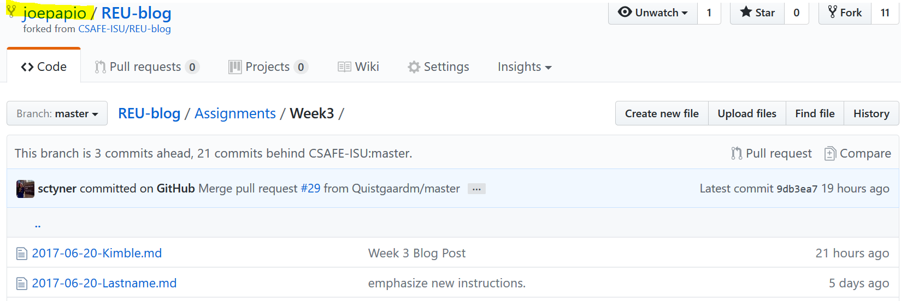
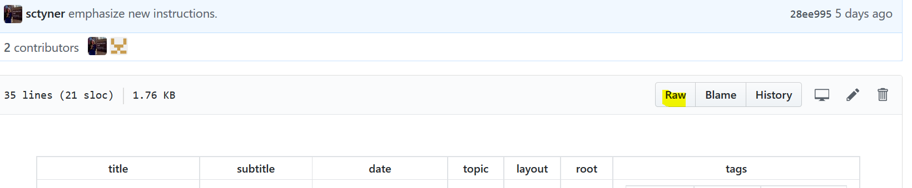
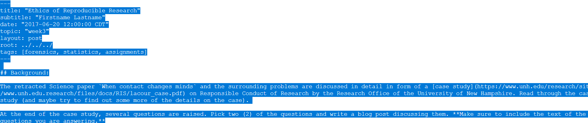
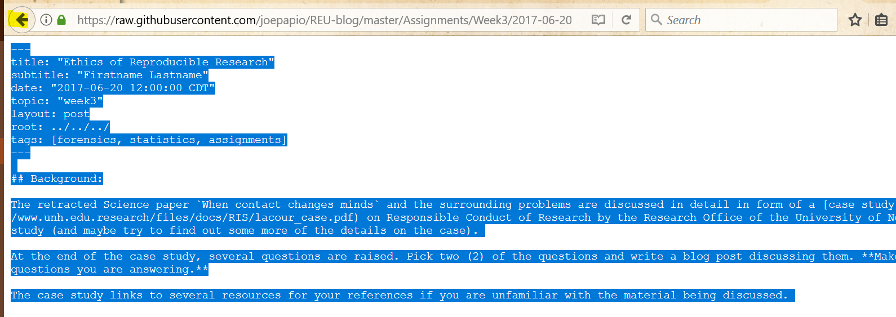
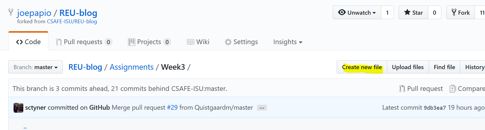
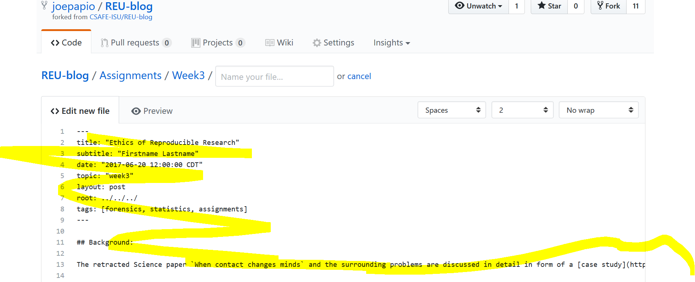
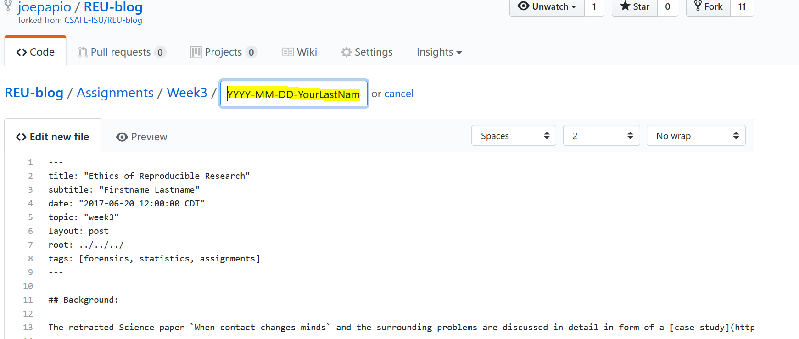
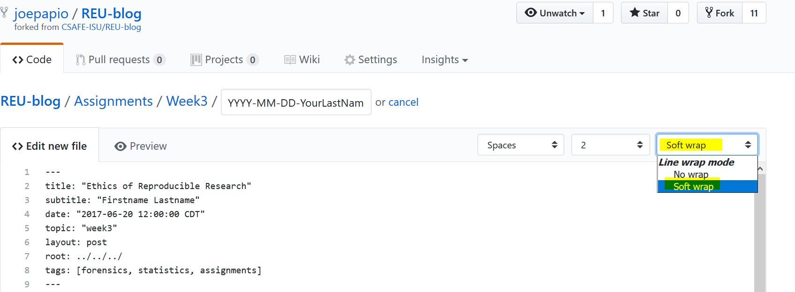
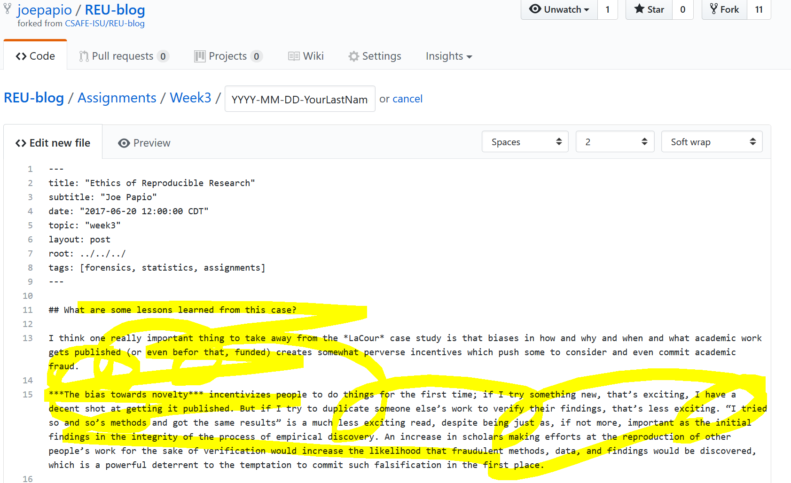
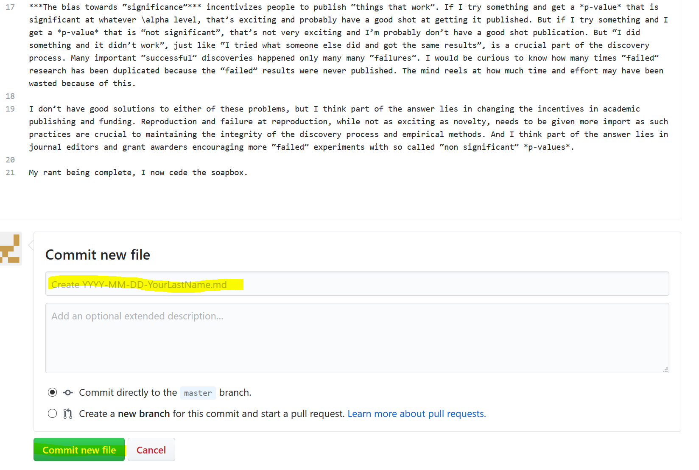

# 1. Make sure you are in your copy of the blog repo, and that you've updated it to include the newest assignment `.md`. Instructions for that are located [here](Update_instructions.md).

# 2. Click on the file for the current assignment.

# 3. Select the `Raw` button to see the underlying code.

# 4. Select all the text of the document. Quickest way to do this is `ctrl + A` followed by `ctrl + C` (or use `cmd` on a mac).

# 5. Click the `back` button **twice** to navigate back the folder containing the assignment.

# 6. Select `Create new file`.

# 7. Paste text into the new file.

# 8. Give the file a name, following the proper naming conventions.

# 9. Change `No Wrap` to `Soft Wrap`.

# 10. Write your assignment, showing us your thought process and whatnot.

# 11. Give your commit a title. (You can also give some commments for extra detail.)

# 12. Click on `pull request` complete the process of submitting a pull request.

